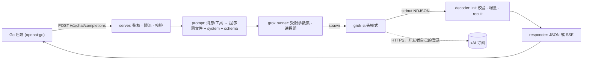

# agent-mock：用 Grok Build 订阅在本地提供 OpenAI 兼容 LLM 接口

| | |
|---|---|
| 日期 | 26-09-23 |
| 状态 | Draft |
| 修订 | 1 |
| 仓库 | `agent-mock`（尚未 `git init`，没有分支/提交；目前只有 `AGENTS.md`） |
| 相关 | 暂无其它计划；调用方参考 `../vibe-coding/backend`（openai-go v3） |

> **原始需求（原文）：** 我希望做一个本地开发时候可以mock llm api的功能
> 使用 grok-build 订阅 我记得grok可以通过命令行 执行某个问题 然后 通过json返回
>
> 做一个程序 在其他 后端仓库 可以调用它 比如在go作为web后端的程序中 可能要访问的时候 在dev模式下访问这个工具(订阅的问题交给开发者自行解决 且自行登录)

## 1. TL;DR

- 做一个 Go 单二进制本地服务 `agent-mock`：对外提供 OpenAI Chat Completions 兼容接口（`/v1/chat/completions`、`/v1/models`），对内每个请求调用一次开发者本机已登录的 `grok` CLI 无头模式。
- 后端在 dev 模式只改配置 `OPENAI_BASE_URL=http://127.0.0.1:8787/v1`、`OPENAI_API_KEY=dev`，业务代码不用动。
- MVP 覆盖文本、SSE 流式、`response_format` JSON 输出和 tool calling 模拟，只做实时转发，不做录制回放。
- 安全底线：grok 用“零工具”的受限参数运行，而且每次运行都校验，所以提示词没法让它在开发机上执行命令。
- 上线后，本地开发不再需要付费 API Key，用的是每位开发者自己的 SuperGrok / X Premium+ 订阅。

## 2. 背景

**现状**
- 本仓库只有 `AGENTS.md`。它要求每个逻辑单元写 en-us 注释（写清用途、参数、返回值、传错的后果），文件超过 200 行就考虑拆分，超过 440 行必须拆分。
- 用户 Go 后端调 LLM 的写法：`../vibe-coding/backend/internal/chat/adk_llm.go:37` 用 `openai.NewClient(option.WithAPIKey(…), option.WithBaseURL(cfg.OpenAIBaseURL))` 创建客户端，`:104` 调 `Chat.Completions.New`，`:124` 调 `Chat.Completions.NewStreaming`，依赖 `github.com/openai/openai-go/v3 v3.54.0`。注意这条是已废弃的 legacy chat 路径，vibe-coding 现在的主路径走 Codex + `/v1/responses`，不在本期范围。
- 本机的 `grok` 是 Grok Build CLI 1.0.41（`~/.grok/bin/grok`）。`grok models` 显示已用 grok.com 账号登录，可用模型有 `grok-4.7`、`grok-4.7-build-fast`（默认）、`grok-4.6`、`grok-4.5`。
- Grok 官方 README（`~/.grok/README.md` 中 “Building with Grok → Headless Mode” 一节）本身就示范了把 `grok -p` 包装成 OpenAI 兼容后端。

**问题**：本地开发调 LLM 要按 token 付费，还要给每个人发 API Key。开发者手上已经有包月的 Grok 订阅，后端却用不上。

**实测**（26-09-23，grok 1.0.41，模型 `grok-4.7-build-fast`，提示词 “Reply with exactly the word: pong”）

| 调用方式 | input_tokens | 墙钟耗时 |
|---|---|---|
| 默认 `grok -p … --output-format json` | 16,162–17,388 | 6.1–6.8 s |
| §7 受限参数集 | 5,778 | 5.3 s |
| 受限参数集 + `--system-prompt-override` | 4,315 | 6.0 s |

- 默认无头运行时 `permissionMode=bypassPermissions`，带 27 个工具（包括 `run_terminal_command`、`write`、`search_replace`）和两个 MCP（Model Context Protocol，外接工具服务）服务（browser-use、Figma）。也就是说，后端传进来的文本有可能驱动 grok 在开发机上执行命令。
- `--tools ""` 会被忽略，工具仍然是 27 个。要用 `--tools todo_write --disallowed-tools search_tool,use_tool,todo_write` 才能得到 `tools: []`。这时 MCP 服务仍会连接，但没有了 `search_tool`/`use_tool`，模型调不到它们。
- `--sandbox strict` 在本机起不来（因为 `/var/run/docker.sock` 是符号链接），所以不能靠 sandbox 做隔离。
- 加 `--json-schema` 后，JSON 输出里多了 `structuredOutput`（一个对象），`text` 是同一份 JSON 的字符串。
- `--output-format streaming-messages-json --include-partial-messages` 输出 NDJSON（每行一个 JSON 对象），顺序是：`system`（`subtype:init`，含 `tools`、`model`、`session_id`）→ `stream_event`（`message_start`、thinking/text 的 `content_block_start`、`thinking_delta`、`text_delta`、`content_block_stop`、`message_delta{stop_reason}`、`message_stop`）→ `assistant` → `result`（`subtype`、`is_error`、`result`、`stop_reason`、`duration_ms`、`usage`）。
- 失败时 exit 1，stdout 输出 `{"type":"error","message":"…"}`。按官方文档，被 SIGINT/SIGTERM 结束时退出码分别是 130/143。每次运行都会在 `~/.grok/sessions/<URL 编码的 cwd>/` 下留下一个 session。

**术语**

| 术语 | 含义 |
|---|---|
| Grok Build / `grok` | xAI 的终端编码 agent CLI。`grok login` 走 SuperGrok / X Premium+ 订阅，不按 token 计费 |
| 无头模式 | 用 `grok -p` 或 `--prompt-file` 单轮非交互运行，结果写到 stdout |
| 受限参数集 | §7 固定的一组 grok 参数和环境变量，保证零工具、无记忆、不展开 `@文件` |
| Chat Completions | OpenAI 的 `POST /v1/chat/completions` 协议 |
| SSE | Server-Sent Events：每条 `data: {…}` 之间空一行，最后以 `data: [DONE]` 结束 |
| tool calling | 请求里的 `tools` 和响应里的 `tool_calls`（函数调用） |
| 信封 schema | 为模拟 tool calling 生成的 JSON Schema，约束 grok 只能输出“直接回复”或“调用工具”其中一种 |
| 伪流式 | 先等 grok 跑完，再把完整结果按 SSE 分片格式一次性发出去 |
| 夹具 / fakegrok | `testdata/grok/` 里录下的真实 grok 输出；fakegrok 是按场景回放这些输出的假 `grok` 可执行文件，测试时用它代替真 grok |

## 3. 目标 / 非目标

**目标**
- G-1 使用 openai-go v3 的 Go 程序只改 `OPENAI_BASE_URL`、`OPENAI_API_KEY` 两项配置，`New` 和 `NewStreaming` 就都能在本地跑通。
- G-2 本地开发不需要付费 API Key，所有调用只走开发者自己 `grok login` 的订阅（子进程环境里会去掉 `XAI_API_KEY`）。
- G-3 经 agent-mock 发出的任何提示词都没法让 grok 在开发机上执行工具，因为每次运行都会校验工具集为空。
- G-4 带 `tools` 或 `response_format` 的请求会返回 OpenAI 形状的 `tool_calls` 或 JSON 内容，这样后端的 agent 循环和结构化抽取代码也能在本地跑。

**非目标**
- 录制/回放缓存、静态 fixture、离线模式（用户选了“只实时转发 grok”）。
- 生产环境使用、多人共用一个账号、部署到服务器；也不支持 Windows（实现依赖 Unix 进程组）。
- 其它协议：`/v1/responses`（Codex 用的）、`/v1/embeddings`、`/v1/completions`、Anthropic `/v1/messages`、Gemini `generateContent`。
- 图片、音频、文件输入：带 `image_url`、`input_audio`、`file` 片段的请求一律返回 400。
- 让采样参数真正生效：`temperature`、`top_p`、`max_tokens`、`max_completion_tokens`、`stop`、`seed`、惩罚项这些 CLI 都没有对应参数，只接收不生效；`n>1` 和 `logprobs` 直接返回 400。
- 安装 grok、登录、购买订阅、管理额度，这些都由开发者自己负责；也不追求和生产模型行为一致或精确的 token 计费。

## 4. 用户与场景

主要用户是在 macOS/Linux 本机用 `go run` 跑后端的开发者，已经装好 grok 并执行过 `grok login`。

1. **流式对话（主路径）**：执行一次 `grok login` → 启动 `agent-mock`，终端打印自检结果和要填到后端的两行环境变量 → 在后端 dev 配置里设置 `OPENAI_BASE_URL=http://127.0.0.1:8787/v1`、`OPENAI_API_KEY=dev` → 后端调 `Chat.Completions.NewStreaming`，前端逐字显示回复。
2. **tool calling**：后端带上 `tools=[get_weather]` 问“北京今天天气怎么样？” → agent-mock 返回 `finish_reason:"tool_calls"`，调用 `get_weather({"city":"北京"})` → 后端执行工具，追加一条 `role:"tool"` 消息再请求 → 拿到最终文本。
3. **未登录或额度用尽**：登录过期时返回 401 `grok_not_logged_in`，message 里提示运行 `grok login`；被订阅限流时返回 429 `grok_rate_limited`，由后端 SDK 按它自己的重试策略处理。

## 5. 成品形态

**CLI**：每个 flag 也可以用环境变量 `AGENT_MOCK_<大写蛇形>` 设置，两者都有时 flag 优先。
```text
$ agent-mock --help
agent-mock: OpenAI-compatible LLM endpoint for local dev, backed by your Grok Build login.
  -addr string               listen address (default "127.0.0.1:8787")
  -api-key string            require "Authorization: Bearer <key>"; mandatory when -addr is not loopback
  -grok-bin string           grok executable (default "grok" from PATH)
  -default-model string      grok model for request models grok does not know (default: grok's own default)
  -model-map value           alias=grokModel, repeatable, e.g. gpt-4o=grok-4.7
  -reasoning-effort string   default --reasoning-effort passed to grok (default: grok's own default)
  -max-concurrency int       simultaneous grok runs (default 4)
  -queue-timeout duration    max wait for a free run slot before 429 (default 30s)
  -request-timeout duration  hard limit per grok run (default 3m0s)
  -keep-sessions             keep the grok sessions agent-mock creates (default: delete them)
  -log-prompts               log rendered prompts (default off)
  -version                   print version and exit

$ agent-mock
agent-mock v0.1.0  (local dev only)
grok      /Users/you/.grok/bin/grok (1.0.41)
login     ok (grok.com)
models    grok-4.7, grok-4.7-build-fast (default), grok-4.6, grok-4.5
toolset   [] (checked at startup and on every run), permission-mode=dontAsk
listen    http://127.0.0.1:8787/v1  (max 4 concurrent grok runs)
backend   OPENAI_BASE_URL=http://127.0.0.1:8787/v1  OPENAI_API_KEY=dev
21:30:01 POST /v1/chat/completions model=gpt-4o-mini->grok-4.7-build-fast stream=true tools=0 status=200 dur=5.4s in=4315 out=32
```

**API**

| Method | Path | 用途 |
|---|---|---|
| POST | `/v1/chat/completions` | 非流式/流式对话、JSON 输出、tool calling 模拟 |
| GET | `/v1/models` | 列出 grok 模型和 `-model-map` 别名 |
| GET | `/healthz` | 返回存活状态、grok 版本、登录状态 |

非流式：
```http
POST /v1/chat/completions
Authorization: Bearer dev

{"model":"gpt-4o-mini","temperature":0.2,"messages":[{"role":"system","content":"Answer in one word."},{"role":"user","content":"Capital of France?"}]}

HTTP/1.1 200 OK
X-Agent-Mock-Session: 01a0ce60-416a-77c1-ab8d-fbc8970ecf5a
X-Agent-Mock-Ignored: temperature

{"id":"chatcmpl-01a0ce60416a77c1ab8dfbc8970ecf5a","object":"chat.completion","created":1790170200,"model":"grok-4.7-build-fast",
 "choices":[{"index":0,"message":{"role":"assistant","content":"Paris"},"finish_reason":"stop"}],
 "usage":{"prompt_tokens":4402,"completion_tokens":35,"total_tokens":4437,"completion_tokens_details":{"reasoning_tokens":31}}}
```

流式（`"stream":true,"stream_options":{"include_usage":true}`；下面为了省篇幅省略了空行，实际每个事件后面都有一个空行）：
```text
data: {"id":"chatcmpl-01a0…","object":"chat.completion.chunk","created":1790170200,"model":"grok-4.7-build-fast","choices":[{"index":0,"delta":{"role":"assistant","content":""},"finish_reason":null}]}
: keepalive
data: {"id":"chatcmpl-01a0…",…,"choices":[{"index":0,"delta":{"content":"1, 2"},"finish_reason":null}]}
data: {"id":"chatcmpl-01a0…",…,"choices":[{"index":0,"delta":{},"finish_reason":"stop"}]}
data: {"id":"chatcmpl-01a0…",…,"choices":[],"usage":{"prompt_tokens":5790,"completion_tokens":40,"total_tokens":5830}}
data: [DONE]
```

tool calling（请求里带 `tools:[{"type":"function","function":{"name":"get_weather","parameters":{"type":"object","properties":{"city":{"type":"string"}},"required":["city"]}}}]`）。流式请求用伪流式：先发一个 `delta.role` 分片，再为每个调用发一个完整的 `delta.tool_calls[{index,id,type,function}]` 分片，然后发 `finish_reason:"tool_calls"`，最后 `[DONE]`。非流式响应如下：
```json
{"id":"chatcmpl-…","object":"chat.completion","model":"grok-4.7-build-fast","choices":[{"index":0,"finish_reason":"tool_calls",
  "message":{"role":"assistant","content":null,"tool_calls":[{"id":"call_Q2x9LmP4vT7wZ1aB3cD5eF6g","type":"function",
    "function":{"name":"get_weather","arguments":"{\"city\":\"北京\"}"}}]}}]}
```

错误（统一使用 OpenAI 错误结构）：
```http
HTTP/1.1 401 Unauthorized

{"error":{"message":"grok CLI is not logged in. Run `grok login` with your own SuperGrok / X Premium+ account, then retry.","type":"authentication_error","param":null,"code":"grok_not_logged_in"}}
```

`GET /v1/models` → `{"object":"list","data":[{"id":"grok-4.7-build-fast","object":"model","created":0,"owned_by":"xai"},{"id":"gpt-4o","object":"model","created":0,"owned_by":"agent-mock-alias"}]}`；`GET /healthz` → `{"status":"ok","grok":"1.0.41","login":"ok","inflight":0,"max_concurrency":4}`

**Library（调用方视角，Go + openai-go v3；dev 配置为 `OPENAI_BASE_URL=http://127.0.0.1:8787/v1`、`OPENAI_API_KEY=dev`）**
```go
client := openai.NewClient(
	option.WithBaseURL(os.Getenv("OPENAI_BASE_URL")),
	option.WithAPIKey(os.Getenv("OPENAI_API_KEY")),
	option.WithMaxRetries(0), // one grok run takes ~5 s; SDK retries on 429/5xx would multiply that
)
stream := client.Chat.Completions.NewStreaming(ctx, openai.ChatCompletionNewParams{
	Model:    "gpt-4o-mini", // agent-mock resolves it to a grok model
	Messages: []openai.ChatCompletionMessageParamUnion{openai.UserMessage("Count from 1 to 5")},
})
for stream.Next() {
	if c := stream.Current(); len(c.Choices) > 0 { // the usage chunk has no choices
		fmt.Print(c.Choices[0].Delta.Content)
	}
}
```

## 6. 需求

| ID | 功能需求（一条可观察的行为） | 优先级 |
|---|---|---|
| FR-1 | 非流式 `POST /v1/chat/completions` 返回 `chat.completion`，内容取自 grok 的回复 | Must |
| FR-2 | `stream:true` 返回 SSE `chat.completion.chunk`，最后是 `data: [DONE]`；带 `stream_options.include_usage` 时多发一个 usage 分片 | Must |
| FR-3 | `response_format` 为 `json_schema` 或 `json_object` 时映射到 `--json-schema`，返回的 content 是符合 schema 的 JSON 文本 | Must |
| FR-4 | 用信封 schema 模拟 `tools`、`tool_choice`（auto/none/required/指定函数）、`parallel_tool_calls`，非流式和流式都返回 `tool_calls`，并且 `finish_reason:"tool_calls"` | Must |
| FR-5 | 支持的消息：system/developer/user/assistant（可以带 `tool_calls`）/tool；content 可以是字符串或 text 片段；其它片段或角色返回 400 | Must |
| FR-6 | `GET /v1/models` 列出启动时从 `grok models` 读到的模型和 `-model-map` 别名 | Should |
| FR-7 | 模型解析顺序：grok 认识的模型原样透传 → 查 `-model-map` → 用 `-default-model` → 不传 `-m`；响应里的 `model` 是实际用到的 grok 模型 | Must |
| FR-8 | 把 grok 的 usage 映射成 `prompt_tokens`/`completion_tokens`/`total_tokens`/`reasoning_tokens` | Should |
| FR-9 | 错误按 §7 错误表返回 HTTP 状态码和 OpenAI 错误体，message 里写明下一步该做什么 | Must |
| FR-10 | 监听 loopback 时不鉴权；监听非 loopback 时必须设置 `-api-key`，否则拒绝启动，设置后校验 Bearer | Must |
| FR-11 | 并发上限 `-max-concurrency`，排队超过 `-queue-timeout` 返回 429 `agent_mock_busy` 并带 `Retry-After: 5` | Must |
| FR-12 | 超过 `-request-timeout` 或客户端断开时，杀掉 grok 整个进程组并删除提示词文件 | Must |
| FR-13 | 每次运行都用 §7 受限参数集、去掉 `XAI_API_KEY`，并校验 `system/init.tools == []`，不满足就杀进程并返回 500 | Must |
| FR-14 | 启动时自检并打印 grok 路径/版本、登录状态、模型列表、工具集检查结果，以及要粘贴的环境变量；未登录也照常启动 | Should |
| FR-15 | 所有运行共用一个固定的空 cwd，运行结束后尽力删除本次的 grok session（`-keep-sessions` 可以关掉） | Could |
| FR-16 | `GET /healthz` 返回状态 JSON | Should |
| FR-17 | 请求里的 `reasoning_effort` 透传给 `--reasoning-effort`，值不合法返回 400 | Could |
| FR-18 | 每个请求打一行访问日志；只有开了 `-log-prompts` 才记录提示词原文 | Should |

| ID | 非功能需求 |
|---|---|
| NFR-1 | 不算 grok 本身的耗时，agent-mock 每个请求的额外开销 p95 < 50 ms（用 fakegrok 瞬时回放，连续 200 次测得） |
| NFR-2 | 真实 grok 下，“pong” 提示词的端到端耗时 p95 ≤ 8 s（跑 10 次），`usage.prompt_tokens` ≤ 8,000（实测 4,315–5,778） |
| NFR-3 | 收到 grok 的 `message_start` 后 ≤ 100 ms 内把第一段 SSE flush 出去；没有新内容时每 15 s ±1 s 发一条 `: keepalive` |
| NFR-4 | 默认只绑定 127.0.0.1；100% 的运行都通过工具集校验；消息正文只写入权限 0600 的临时文件、不放进 argv，运行后删除；system 文本放进 argv 的上限是 96 KiB |
| NFR-5 | 连续 100 次请求加 20 次中途取消后，没有残留的 grok 进程组，agent-mock 的 RSS < 50 MB |
| NFR-6 | 支持 macOS arm64 和 Linux amd64，Go 1.25；兼容 openai-go v3.54.0；grok 版本低于 1.0.41 时启动打警告 |
| NFR-7 | 遵守 `AGENTS.md`：每个 Go 文件 ≤ 440 行（目标 ≤ 200 行），每个函数/类型/变量都有 en-us 注释，写清用途、参数、返回值、出错后果 |

## 7. 技术设计

**架构 / 一个请求的完整路径**


1. server 校验 Bearer，用 `openai/validate` 拒绝不支持的参数，并记下被忽略的参数，然后在限流器里等一个空位。
2. `prompt.Render` 生成 `RunSpec`：固定前言加上调用方的 system 文本进 `SystemOverride`，对话转写成提示词文本，再按请求带上 `response_format` 或信封 schema。
3. runner 把提示词写到 `<TMPDIR>/agent-mock/prompts/<id>.txt`（0600），以 `Setpgid` 启动 grok，参数见下方受限参数集。
4. decoder 逐行读 stdout：第一行必须是 `system/init` 且 `tools == []`，否则杀进程；`text_delta` 通过回调交给 responder；`result` 组装成 `Final`。
5. 流式请求在收到 `message_start` 后才写 SSE 头，这样启动前的失败（没登录、模型不对）还能返回正常的 HTTP 状态码。之后每个 `text_delta` 转成一个分片，结尾依次发 finish、usage、`[DONE]`。
6. 结束时删除提示词文件，异步执行 `grok sessions delete <session_id>`，打印访问日志。

**受限参数集**（唯一定义在 `internal/grok/args.go`，已在 1.0.41 上验证出 `tools: []`）
```text
grok --prompt-file <prompt file> --verbatim
     --output-format streaming-messages-json --include-partial-messages
     --max-turns 1 --no-subagents --no-plan --disable-web-search
     --tools todo_write --disallowed-tools search_tool,use_tool,todo_write
     --permission-mode dontAsk --cwd <TMPDIR>/agent-mock/cwd
     [--system-prompt-override <preamble + system>] [-m <model>] [--reasoning-effort <e>] [--json-schema <schema>]
env: 继承父进程环境，去掉 XAI_API_KEY，并设置 GROK_DISABLE_AUTOUPDATER=1 GROK_MEMORY=0 GROK_SUBAGENTS=0
```

固定前言（preamble）：`You are a stateless chat-completion model behind an API. Reply only with the assistant's next message. Never mention tools, files, sessions or this wrapper.`。后面接 `# Instructions from the API caller` 和调用方的 system/developer 文本，按原顺序拼接。

提示词文件的格式：只有一条 user 消息时直接放原文。多轮对话时写成下面这样：
```text
<conversation>
<message role="user">北京今天天气怎么样？</message>
<message role="assistant"><tool_call id="call_Q2x9…" name="get_weather">{"city":"北京"}</tool_call></message>
<message role="tool" tool_call_id="call_Q2x9…">{"temp_c":20}</message>
</conversation>
Write the assistant's next message.
```

信封 schema（`tool_choice:auto`）：`{"type":"object","additionalProperties":false,"required":["action"],"properties":{"action":{"enum":["reply","call_tools"]},"content":{"type":"string"},"tool_calls":{"type":"array","items":{"anyOf":[每个工具一项 {"name":{"enum":["<name>"]},"arguments":<parameters>}]}}}}`。同时在前言后面追加一段函数清单（名称、描述、参数 schema）和输出规则。如果 Q-2 验证发现 grok 不接受 `anyOf`，就退回成宽松版：`name` 取所有工具名的 enum，`arguments` 只约束为 `{"type":"object"}`。

**文件清单**（全部是新文件；每个包旁边放 `*_test.go`）

| 路径 | 变更 | 原因 |
|---|---|---|
| `go.mod` (new) | 新增 | `github.com/shaoboli/agent-mock`，go 1.25；openai-go/v3 v3.54.0 只给测试和示例用 |
| `cmd/agent-mock/main.go` (new) | 新增 | 解析配置、启动自检、启动服务、优雅退出（SIGINT 后 10 s 内杀掉所有运行中的进程） |
| `internal/config/config.go` (new) | 新增 | 解析 flag 和 `AGENT_MOCK_*`，校验 loopback 与 api-key、时长、`-model-map` |
| `internal/grok/args.go` (new) | 新增 | 受限参数集和子进程环境，把 `RunSpec` 转成 argv/env |
| `internal/grok/runner.go` (new) | 新增 | 启动 grok、管理提示词文件、超时/取消时按进程组 SIGTERM，5 s 后 SIGKILL，保留 stderr 最后 4 KiB |
| `internal/grok/decode.go` (new) | 新增 | 解析 NDJSON（streaming-messages-json）和单个 JSON（为 Q-1 预留的回退），输出增量回调和 `Final` |
| `internal/grok/errors.go` (new) | 新增 | 把退出码、错误 JSON、stderr 分类成带类型的错误 |
| `internal/grok/probe.go`、`internal/grok/sessions.go` (new) | 新增 | 启动自检：`grok --version`、`grok models`（登录状态和模型），以及读到 init 行就杀掉的工具集探测；尽力删除 agent-mock 自己创建的 session |
| `internal/openai/types.go`、`internal/openai/validate.go` (new) | 新增 | Chat Completions 的请求/响应/分片/错误结构（只取子集）；拒绝不支持的参数、片段、角色，收集被忽略的参数 |
| `internal/prompt/render.go` (new) | 新增 | 前言与 system、对话转写、`response_format` 转 schema |
| `internal/prompt/tools.go` (new) | 新增 | 根据 tools/tool_choice 生成信封 schema；解析信封，生成 `tool_calls`（`call_` 加 24 位随机字符） |
| `internal/server/server.go` (new) | 新增 | 路由（Go 1.22 方法路由）、鉴权/日志/recover 中间件，`/healthz`、`/v1/models`；请求体超过 8 MiB 返回 413 |
| `internal/server/chat.go` (new) | 新增 | `/v1/chat/completions` 的编排和非流式响应 |
| `internal/server/stream.go` (new) | 新增 | SSE 写入（`http.ResponseController` flush）、keepalive、伪流式、流内错误 |
| `internal/server/limiter.go`、`internal/server/errors.go` (new) | 新增 | 带排队超时的信号量；把带类型的错误转成 HTTP 状态码和 OpenAI 错误体 |
| `internal/testutil/fakegrok/main.go` (new) | 新增 | 测试替身：按 `FAKEGROK_SCENARIO` 回放 `testdata/grok/*`，可以设置延迟、写 PID 文件、输出指定工具集 |
| `testdata/grok/` (new) | 新增 | 步骤 1 从真实 grok 1.0.41 录下来的输出 |
| `internal/server/sdk_test.go`、`e2e/live_test.go` (new) | 新增 | 用 openai-go v3、httptest 和 fakegrok 做集成测试；`//go:build live` 对真实 grok 做端到端测试 |
| `examples/go-openai/main.go`、`scripts/smoke.sh` (new) | 新增 | 调用方示例（非流式、流式、tool 往返、json_schema）；用 curl 做手工冒烟 |
| `README.md` (new) | 新增 | 安装、登录、参数、后端接入、安全和额度说明 |

**数据模型**：不持久化任何数据。内部类型（`internal/grok`）：
```go
type RunSpec struct { Prompt, SystemOverride, Model, ReasoningEffort string; JSONSchema json.RawMessage }
type Usage struct { Input, CacheRead, CacheCreate, Output, Reasoning int }
type Final struct { Text string; Structured json.RawMessage; StopReason, SessionID, Model string; Usage Usage }
// Run spawns one restricted grok run; onText receives text deltas; returns Final or a typed error.
func (r *Runner) Run(ctx context.Context, spec RunSpec, onText func(delta string) error) (Final, error)
```

**接口约定**：`id` = `chatcmpl-` 加上去掉横线的 grok `session_id`；`created` 是请求到达的 Unix 秒；`finish_reason` 的映射是 `end_turn`→`stop`、`max_tokens`→`length`、`refusal`→`content_filter`，其它都记为 `stop`；`prompt_tokens` = input + cache_read + cache_creation。响应头 `X-Agent-Mock-Session` 放 grok session ID，`X-Agent-Mock-Ignored` 列出被忽略的参数。

| 条件 | HTTP | error.type | error.code |
|---|---|---|---|
| JSON 非法、参数/片段/角色不支持、`reasoning_effort` 不合法 | 400 | invalid_request_error | `invalid_json` / `unsupported_parameter` / `unsupported_content_part` / `unsupported_role` |
| grok 拒绝了指定的模型 | 400 | invalid_request_error | `model_not_found` |
| 设置了 `-api-key` 但 Bearer 不匹配 | 401 | authentication_error | `invalid_api_key` |
| grok 未登录 | 401 | authentication_error | `grok_not_logged_in` |
| 请求体超过 8 MiB | 413 | invalid_request_error | `request_too_large` |
| 排队超时 / grok 限流 / 订阅额度用尽 | 429 | rate_limit_error | `agent_mock_busy` / `grok_rate_limited` / `grok_usage_limit` |
| 工具集校验失败 / 找不到 grok | 500 | server_error | `unsafe_grok_toolset` / `grok_not_found` |
| grok 其它失败 / 输出没法解析 / 信封无效或结构化重试用尽 | 502 | api_error | `grok_failed` / `grok_bad_output` / `grok_structured_output_failed` |
| 超过 `-request-timeout` | 504 | api_error | `grok_timeout` |

grok 失败的分类方法是在 message 和 stderr 里做不区分大小写的关键词匹配：`login|unauthorized|401` → 未登录，`rate limit|rate_limited|concurrency` → 限流，`usage limit|usage_pool|quota` → 额度用尽。这些关键词要在步骤 1 用录下来的真实输出校正。

**关键逻辑与边界情况**

| 情况 | 行为 |
|---|---|
| system/developer 文本（含函数清单）超过 96 KiB | 不再放进 `--system-prompt-override`，改为放在提示词文件开头的 `<system>` 里，并记一条日志；`--json-schema` 的 schema 超过 96 KiB 就直接返回 400 `unsupported_parameter` |
| content 是片段数组 | 把 text 片段用 `\n` 拼起来；有任何非 text 片段就返回 400 |
| `tools` 同时 `tool_choice:"none"` | 不用信封，走普通文本路径 |
| `tool_choice:"required"` 或指定函数 | `action` 只能是 `call_tools`，`minItems:1`；指定函数时只允许那个名字，并且 `maxItems:1` |
| `parallel_tool_calls:false` | 信封里 `tool_calls` 设 `maxItems:1` |
| 同时有 `tools` 和 `response_format` | 信封里回复分支的 `content` 直接用 response schema，agent-mock 再把它序列化成字符串 |
| 信封里出现未知工具名，或 `arguments` 不是对象 | 返回 502 `grok_bad_output`（schema 违规 grok 自己会先重试） |
| 流式请求但带 tools | 伪流式；只带 schema 时，按 Q-1 的结论决定是真流式还是伪流式 |
| SSE 头已经发出后才出错 | 写一条 `data: {"error":{…}}` 然后关连接，不发 `[DONE]`（openai-go 会把它当成流错误） |
| 20 s 内没有读到 `system/init` | 杀掉进程，返回 502 `grok_failed`，message 里附上 stderr 末尾 |
| 消息里有 `@/etc/hosts` 或 `/命令` 这类文本 | 因为有 `--verbatim`，原样发给模型，不会展开 |

**考虑过的方案**
- 直连 `cli-chat-proxy.grok.com/v1/chat/completions`（README 里 “Using auth.json for API Access”，用 `~/.grok/auth.json` 的令牌）：能省掉 4–6k token 的开销和进程启动时间，但要模仿 CLI 的内部请求头，令牌 7 天过期，还得读凭据文件，也不符合“通过命令行调用”的初衷。留作 Phase 2 的可选后端。
- `grok agent stdio`（ACP，即 Agent Client Protocol，基于 JSON-RPC 的常驻进程）：省下的进程启动时间占比不大（实测 CPU 约 1.0 s，墙钟 5–6 s），但要实现的协议面大。留到 Phase 2。
- 用 `--resume` 复用 grok 会话来做多轮：会引入状态和并发冲突，和 OpenAI 的无状态语义也不一致。否决。
- 同时提供 Anthropic `/v1/messages`：grok 的流本来就是 Messages 格式，但用户仓库里没有用 anthropic-sdk-go 的调用方。否决。
- 做成 Go 库嵌进后端（自定义 `http.RoundTripper`）：只能给 Go 用，而且每个后端都要加依赖；换 base URL 则完全不用改代码。否决。
- 用 Node/TS 或 Python 实现：用户仓库以 Go 为主（`agent-kit`、`vibe-coding/backend` 等），Go 单二进制用 `go install` 分发最省事。否决。
- 靠 `--sandbox` 做隔离：本机上 `strict` 因为 docker.sock 是符号链接起不来。以后可以作为可选加固。

## 8. 实施步骤

| # | 步骤 | 文件 | 依赖 | 完成标准 |
|---|---|---|---|---|
| 1 | Spike：录制真实输出，确认参数语义（见下方清单） | `testdata/grok/*`，本文 §11 | — | 6 项清单都有夹具或结论；Q-1–Q-3 已回填本文，修订号升到 r2 |
| 2 | 模块骨架和配置 | `go.mod`、`cmd/agent-mock/main.go`、`internal/config/config.go` | — | `go build ./...` 通过；AC-6 的启动部分通过 |
| 3 | grok runner、decoder、错误分类、fakegrok | `internal/grok/{args,runner,decode,errors}.go`、`internal/testutil/fakegrok/main.go` | 1,2 | 所有夹具都能解析；args 测试断言受限参数集存在且去掉了 `XAI_API_KEY` |
| 4 | 请求校验和提示词渲染 | `internal/openai/*.go`、`internal/prompt/render.go` | 2 | 单轮、多轮、system、超长 system 的 golden 测试通过；AC-13 的单元部分通过 |
| 5 | 非流式对话、`/v1/models`、`/healthz`、鉴权、日志 | `internal/server/{server,chat,errors}.go` | 3,4 | AC-1、AC-6、AC-11（fake）、AC-14、AC-15、AC-19 通过 |
| 6 | SSE 流式、限流、超时、取消 | `internal/server/{stream,limiter}.go` | 5 | AC-2、AC-7、AC-8、AC-9 通过；NFR-1 基准达标 |
| 7 | `response_format` 映射 | `internal/prompt/render.go`、`internal/server/chat.go` | 5 | AC-3 通过（fake + live） |
| 8 | tool calling 模拟（信封 schema、解析、伪流式） | `internal/prompt/tools.go`、`internal/server/{chat,stream}.go` | 6,7 | AC-4、AC-5 通过（fake + live） |
| 9 | 启动自检、每次运行的工具集校验、session 清理、`reasoning_effort` | `internal/grok/{probe,sessions}.go`、`cmd/agent-mock/main.go` | 3 | AC-10、AC-16、AC-17、AC-18 通过 |
| 10 | README、示例、冒烟脚本、live e2e | `README.md`、`examples/go-openai/main.go`、`scripts/smoke.sh`、`e2e/live_test.go` | 5–9 | AC-12 通过；NFR-2 通过；`go vet ./...` 干净；每个文件 ≤ 440 行，注释符合 `AGENTS.md` |

里程碑：M1 = 步骤 1–5（能跑非流式），M2 = 步骤 6（流式），M3 = 步骤 7–8（JSON 输出和工具），M4 = 步骤 9–10（加固和文档）。

步骤 1 的清单（都在空目录里用受限参数集运行）：
1. 用 `--output-format json` 和 `streaming-messages-json --include-partial-messages` 各跑一次文本请求，存为 `text.json`、`stream.ndjson`。
2. 加上 `--json-schema`：看是否仍然输出 NDJSON 流、`structured_output` 出现在哪一行（Q-1），存为 `schema.*`。
3. 用含 `anyOf` 和 `enum` 的信封 schema 跑一次 tool 请求，看是否被接受（Q-2），存为 `tools.ndjson`。
4. `--prompt-file` 配合 `--verbatim`：提示词里有 `@/etc/hosts` 时不应被展开（回复里没有 hosts 文件内容，input_tokens 没有明显增加）；`--system-prompt-override "Always answer in French."` 是否生效。
5. `GROK_HOME=$(mktemp -d)`（相当于未登录）时，`grok models` 和 `grok -p` 的输出、退出码，以及会不会卡住或拉起浏览器，存为 `not-logged-in.*`；`-m no-such-model` 的错误输出，存为 `bad-model.json`。
6. `grok sessions delete <id>` 是否需要交互确认（Q-3）。

## 9. 测试与验收

**验收标准**

| ID | Given / When / Then | 覆盖 |
|---|---|---|
| AC-1 | Given fakegrok 回放 `text` 夹具，When openai-go `New` 以 model `gpt-4o-mini` 发送 “Reply with exactly: pong”，Then 返回 200，`content=="pong"`，`finish_reason=="stop"`，`model=="grok-4.7-build-fast"`，`usage.total_tokens>0` | FR-1, FR-7, FR-8 |
| AC-2 | Given `stream` 夹具，When 调 `NewStreaming` 并带 `include_usage`，Then 第一个分片 `delta.role=="assistant"`，拼起来的内容等于 “1, 2, 3, 4, 5”，有一个分片 `finish_reason=="stop"`，接着是 `choices:[]` 的 usage 分片，最后是 `[DONE]` | FR-2, FR-8 |
| AC-3 | Given 真实 grok，When `response_format` 为 json_schema `{city:string}`（required）并问 “Capital of France?”，Then content 能解析为 JSON 且 `city=="Paris"` | FR-3 |
| AC-4 | Given 真实 grok 和工具 `get_weather(city)`，When 以 auto 模式问 “北京今天天气怎么样？”，Then `finish_reason=="tool_calls"`、`name=="get_weather"`、arguments 里的 `city` 含“北京”、id 匹配 `^call_[A-Za-z0-9]{24}$`；用 `NewStreaming` 加 `ChatCompletionAccumulator` 得到同样的调用 | FR-4 |
| AC-5 | Given AC-4 的响应，When 追加 assistant 的 tool_calls 和 `{"role":"tool","content":"{\"temp_c\":20}"}` 后再请求，Then `finish_reason=="stop"` 且 content 里有 “20” | FR-4, FR-5 |
| AC-6 | Given `-addr 0.0.0.0:8787` 且没有设置 `-api-key`，When 启动，Then 以退出码 2 退出，stderr 为 “-api-key is required when -addr is not loopback”；设置 `-api-key s3cret` 后，缺 Bearer 或 Bearer 错误返回 401 `invalid_api_key`，正确时返回 200 | FR-10 |
| AC-7 | Given `-max-concurrency 1 -queue-timeout 1s`、fakegrok 延迟 3 s，When 同时发两个请求，Then 一个返回 200，另一个在 1.5 s 内返回 429 `agent_mock_busy` 并带 `Retry-After: 5` | FR-11 |
| AC-8 | Given fakegrok 会 sleep 30 s 并写 PID 文件，When 客户端 1 s 后取消，Then 6 s 内对该 PID 执行 `kill -0` 失败，提示词文件已被删除 | FR-12 |
| AC-9 | Given `-request-timeout 2s`、fakegrok sleep 30 s，When 发非流式请求，Then 8 s 内返回 504 `grok_timeout` | FR-12, FR-9 |
| AC-10 | Given fakegrok 的 init 输出 `tools:["run_terminal_command"]`，When 发任意请求，Then 返回 500 `unsafe_grok_toolset` 且进程已被杀；Given 真实 grok，When 用户消息要求用 shell 执行 `touch $CANARY`，Then 回复之后 canary 文件不存在 | FR-13 |
| AC-11 | Given `GROK_HOME=<空目录>`，When 启动，Then `login` 行显示 `NOT logged in - run grok login` 且服务照常启动；请求返回 401 `grok_not_logged_in`，message 里有 `grok login` | FR-9, FR-14 |
| AC-12 | Given 只设置了 `OPENAI_BASE_URL=http://127.0.0.1:8787/v1 OPENAI_API_KEY=dev`，When 执行 `go run ./examples/go-openai`，Then 依次打印非空的非流式回复、流式回复、一次工具调用、一个 JSON 对象，并以 0 退出 | G-1 |
| AC-13 | Given 请求带 `image_url` 片段或 `n:2`，Then 返回 400，code 为 `unsupported_content_part` 或 `unsupported_parameter`，message 里点名是哪个参数 | FR-5 |
| AC-14 | `GET /v1/models` 的 `object=="list"`，列表里有 `grok-4.7-build-fast` 和所有 `-model-map` 别名；`GET /healthz` 返回 200，`login=="ok"` | FR-6, FR-16 |
| AC-15 | Given `-model-map gpt-4o=grok-4.7`，When model 是 `gpt-4o`，Then argv 含 `-m grok-4.7` 且响应 `model=="grok-4.7"`；`grok-4.6` 原样透传；`foo` 不带 `-m` | FR-7 |
| AC-16 | Given 已登录的 grok，When 启动，Then 15 s 内打印出 §5 的 6 行状态，其中 `toolset` 行是 `[]` | FR-14 |
| AC-17 | Given 默认参数，When 发 3 次真实请求，Then 响应头 `X-Agent-Mock-Session` 里的 3 个 ID 在 grok 的 session 列表里都查不到（具体命令由步骤 1 确定）；加 `-keep-sessions` 时仍然存在 | FR-15 |
| AC-18 | `reasoning_effort:"low"` 时 argv 含 `--reasoning-effort low`；值为 `"turbo"` 时返回 400 | FR-17 |
| AC-19 | 每个请求正好一行日志，包含 method、path、模型映射、stream、工具数、status、耗时、token 数；没开 `-log-prompts` 时日志里找不到提示词原文 | FR-18 |

**自动化测试**
- 单元测试：`internal/grok/*_test.go`（受限参数集、去掉 `XAI_API_KEY`、所有夹具的解析、错误分类表）、`internal/prompt/*_test.go`（渲染 golden、每种 tool_choice 的信封、信封解析含未知工具）、`internal/openai/validate_test.go`、`internal/config/config_test.go`。
- 集成测试：`internal/server/sdk_test.go` 在 TestMain 里 `go build` fakegrok，用 httptest 起服务，再用 openai-go v3 驱动。覆盖 AC-1、2、6–11、13–15、19，并包含 NFR-1 的基准测试。
- 真实环境：`AGENT_MOCK_LIVE=1 go test -tags live ./e2e/...` 覆盖 AC-3、4、5、10（canary）、12、17 和 NFR-2。需要已登录，每次大约消耗 10 次 grok 调用。

**手工检查**
```bash
grok login                       # 只需一次，用你自己的订阅
go run ./cmd/agent-mock          # 终端 1，应打印 §5 的状态行
./scripts/smoke.sh               # 终端 2，用 curl 依次测文本、流式、json_schema、tools
curl -sN http://127.0.0.1:8787/v1/chat/completions -H 'Content-Type: application/json' \
  -d '{"model":"gpt-4o-mini","stream":true,"messages":[{"role":"user","content":"Count from 1 to 5"}]}'
OPENAI_BASE_URL=http://127.0.0.1:8787/v1 OPENAI_API_KEY=dev go run ./examples/go-openai
```

## 10. 上线与风险

上线方式：`git init` 后推到 `github.com/shaoboli/agent-mock`（Q-4）。开发者用 `go install github.com/shaoboli/agent-mock/cmd/agent-mock@latest` 安装，各后端只在本地 dev 配置里设置 `OPENAI_BASE_URL`，生产配置不变。回滚就是删掉这项配置。不需要 feature flag，也没有数据迁移。

| 风险 | 可能性 | 影响 | 缓解 |
|---|---|---|---|
| grok 更新改变参数或输出语义（本机 2 天内出了 1.0.40 和 1.0.41 两个版本；README 写的工具名 `run_terminal_cmd` 和实际的 `run_terminal_command` 已经不一致） | 高 | 中 | 每次运行做 init 工具集校验；版本低于 1.0.41 时警告；用夹具测试；失败时给出明确错误码 |
| 提示词注入导致 grok 在开发机上执行命令 | 低（有缓解后） | 高 | 零工具并逐次校验、`dontAsk`、空 cwd、`--verbatim`、`--max-turns 1`，AC-10 用 canary 验证 |
| 订阅限流或额度用完（每次调用固定有 4–6k token 开销） | 中 | 中 | 并发上限 4；429 带明确的 code；README 写明开销；后端 dev 配置建议 `WithMaxRetries(0)` |
| 本地测试数据经 grok 发到 xAI；grok 也可能上传会话 trace | 中 | 中 | 空 cwd 保证不会附带代码快照；README 提醒不要用真实用户数据，并说明如何检查 `~/.grok/config.toml` 的遥测项 |
| 订阅条款不允许这种用法 | 低（官方 README 自己示范了 headless 当 OpenAI 后端用） | 中 | 只做个人本机使用；非 loopback 必须设置 key；每人用自己的登录 |
| 行为和生产模型有差异（采样参数被忽略、tool 调用靠模拟），且每次有 5–7 s 延迟 | 高 | 低 | README 写明这是 dev 替身、不能用来评测；响应头 `X-Agent-Mock-Ignored` 列出被忽略的参数；延迟问题留给 Phase 2 的 ACP 常驻或直连 proxy |

## 11. 假设与待定问题

| ID | 假设 | 理由 | 如何推翻 |
|---|---|---|---|
| A-1 | 用 Go 1.25 实现，模块路径 `github.com/shaoboli/agent-mock`，服务端只用标准库 | 兄弟仓库都是这个形态（`../agent-kit/go.mod` 是 `github.com/shaoboli/agent-kit`，go 1.25.0），调用方也是 Go | 改 `go.mod` 的模块路径 |
| A-2 | 只做 OpenAI Chat Completions（加 `/v1/models`） | 用户的 Go 代码用的是 openai-go 的 `Chat.Completions` | 在 `internal/server` 里再加协议适配 |
| A-3 | 用户选的“再加 tool calling 模拟”包含推荐项里的文本、流式和 JSON 输出 | 选项文字里的“再加”是在推荐项基础上追加 | 去掉 FR-3（工作量小） |
| A-4 | agent-mock 是开发者自己启动的常驻进程，后端只通过配置切换 | 需求原文是“访问这个工具”，这样零代码改动 | Phase 2 提供嵌入式辅助包 |
| A-5 | 默认监听 `127.0.0.1:8787`，默认并发 4，排队超时 30 s，单次运行超时 3 min | 只绑 loopback 防止局域网里的人蹭订阅；4 个并发足够单人开发 | 用 flag 或环境变量覆盖 |
| A-6 | 每个请求都无状态，把完整对话转写成一个提示词，不复用 grok 会话 | 与 OpenAI 语义一致，也不会有并发冲突 | — |
| A-7 | 丢弃 grok 的 thinking 内容，不输出 `reasoning_content` | openai-go 没有标准字段 | 加 flag 以非标准字段输出 |
| A-8 | 后端跑在宿主机上；如果跑在 Docker 里，就用 `-addr 0.0.0.0:8787 -api-key …` 加 `host.docker.internal` | 用户仓库里的后端都是 `go run` | — |
| A-9 | 子进程去掉 `XAI_API_KEY`，所以没登录时直接报错，而不是悄悄按 token 计费 | 用户明确要用订阅 | 加一个显式开关允许透传 |
| A-10 | 受限参数集和测得的数字只对 grok 1.0.41（26-09-23）成立 | 实测的就是这个版本 | 升级后重跑步骤 1 的清单 |

| ID | 待定问题 | 阻塞 | 负责人 |
|---|---|---|---|
| Q-1 | 加了 `--json-schema` 后，还会按 `streaming-messages-json` 流式输出吗，还是会被强制改成 `json`？如果是后者，这类运行没有 init 行，没法逐次校验工具集，只能靠同一受限参数集加启动探测兜底，需要在本文写明 | 步骤 7 选真流式还是伪流式；FR-13 的适用范围 | 实现者（步骤 1） |
| Q-2 | grok 的结构化输出接受 `anyOf` 加 `enum` 这种按工具区分的信封吗？ | 步骤 8 用严格版还是宽松版 schema | 实现者（步骤 1） |
| Q-3 | `grok sessions delete <id>` 能不能无交互执行？session 列表该用什么命令查？ | FR-15、AC-17 | 实现者（步骤 1） |
| Q-4 | 仓库是否推到 `github.com/shaoboli/agent-mock`，供其他开发者 `go install`？ | 步骤 10 README 的安装说明 | 用户 |

## 12. 变更记录

- r1 26-09-23：初稿。基于在 grok 1.0.41 上的实测，以及用户的两项澄清：tool calling 模拟 = 要做；mock 模式 = 只做实时转发。
