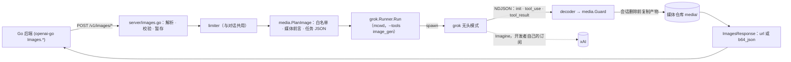
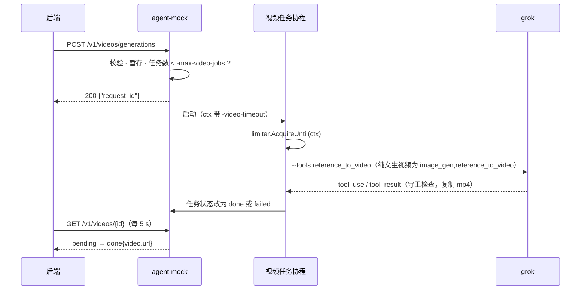

# agent-mock 图片/视频生成：经 grok CLI 媒体工具提供 OpenAI Images 与 xAI Videos 接口

| | |
|---|---|
| 日期 | 26-09-26 |
| 状态 | Draft |
| 修订 | 1 |
| 仓库 | [grok2api](https://github.com/bo-516/grok2api)（命令名 `agent-mock`）@ `main`（`bb23684`） |
| 相关 | [26-09-23-grok-openai-mock.md](26-09-23-grok-openai-mock.md)：对话接口的原方案。本文沿用它的受限参数集、错误体、fakegrok 和 live 测试框架，下文简称“原方案” |

> **原始需求（原文）：** 你帮我设计一下 实现支持 图片/视频 的方案吧 要md文件放docs目录  不用改代码
>
> **前情：** 用户先在 grok-build 里问“我们现在支持 视频/图片的生成吗”，答复是不支持。又问“能支持吗”，答复是：grok 1.0.41 自带 `image_gen`、`image_edit`、`reference_to_video`，但 agent-mock 要求每次运行的工具集是 `[]`，所以要让对话接口继续零工具，另开媒体接口。
>
> **澄清（26-09-26）：**
> - 范围：图片生成和编辑、视频生成，分两个里程碑做。
> - 后端：走 grok CLI 的媒体工具，不直连 api.x.ai。
> - 接口：图片接口学 OpenAI，视频接口学 xAI。

## 1. TL;DR

- 新增 4 个接口：
  - `POST /v1/images/generations` 和 `POST /v1/images/edits`：OpenAI 形状，openai-go 的 `Images.Generate` / `Images.Edit` 可直接调用。
  - `POST /v1/videos/generations` 和 `GET /v1/videos/{request_id}`：xAI 形状，异步。
  - 产物放在 `GET /v1/media/{name}`，默认保留 1 小时。
- 每个媒体请求仍是一次 grok 无头运行，只放开这次要用的媒体工具（如 `--tools image_gen`）：
  - init 的工具集必须正好等于白名单。
  - 模型发出的每个工具调用都要过守卫；图片路径只能是本请求暂存的输入。
  - 不合规就杀掉进程组，调用方拿不到产物。
- 对话接口不改，仍是零工具。
- 上线后，后端 dev 配置不用动，本地就能出图、改图、出视频，用的是开发者自己的 SuperGrok 订阅。生产把 base URL 换成 api.x.ai 即可。
- 分两个里程碑：M1 图片（步骤 1–9），M2 视频（步骤 10–12）。

## 2. 背景

**现状**（`main` @ `bb23684`）
- 路由只有 4 个：对话、模型列表、健康检查、用法说明（`internal/server/server.go:82`–`85`）。chat 消息里有 `image_url`、`input_audio`、`file` 片段时返回 400（`internal/openai/validate.go:170`–`199`）。
- 每次运行都用同一组受限参数（`internal/grok/args.go:41`–`69`）：
  - `--tools todo_write --disallowed-tools search_tool,use_tool,todo_write`，让工具集为空。
  - `--max-turns 1`、`--permission-mode dontAsk`。
  - 共享的空 cwd `<TMPDIR>/agent-mock/cwd`。
- `internal/grok/runner.go:124`–`133` 在 init 行检查 `tools` 必须正好是 `[]`。不是的话，SIGKILL 进程组，返回 500 `unsafe_grok_toolset`。
- 解码器只处理 `system`、`stream_event`、`assistant`、`result`、`error` 五种行（`internal/grok/decode.go:183`–`227`）。装着 `tool_result` 的 `user` 行直接跳过，`assistant` 行只取 text 块。
- 运行结束后异步执行 `grok sessions delete <id>`（`internal/grok/runner.go:301`–`314`）。请求体上限 8 MiB（`internal/server/server.go:18`）。
- `internal/grok/runner.go` 420 行，`internal/grok/decode.go` 418 行，已经贴近 `AGENTS.md` 的 440 行硬上限。要先把这两个文件拆开，新逻辑放新文件。

**grok 1.0.41 的媒体工具**（来源：本机 `~/.grok/sessions/*/tool_definitions.json` 里的工具定义、`~/.grok/bundled/skills/imagine/SKILL.md`、`~/.grok/docs/user-guide/` 第 04、05、14、22、26 篇）

`image_gen`：文生图。

| 参数 | 取值 |
|---|---|
| `prompt` | 必填 |
| `aspect_ratio` | `1:1`、`16:9`、`9:16`、`3:2`、`2:3`、`auto`（默认） |

- 返回：保存后图片的绝对路径。会话内的相对路径形如 `images/1.jpg`。
- 没有 `n` 参数，要多张就多次调用。

`image_edit`：图片编辑。

| 参数 | 取值 |
|---|---|
| `prompt` | 必填 |
| `image[]` | 必填。每项是附件占位符 `[Image #N]`、绝对路径或 `data:image/…` URL |
| `aspect_ratio` | 只在多图编辑时生效 |

- 返回：同 `image_gen`。
- 参考图会先缩到长边约 768 px。

`reference_to_video`：参考图生视频。

| 参数 | 取值 |
|---|---|
| `prompt` | 必填 |
| `aspect_ratio` | 必填：`1:1`、`16:9`、`9:16`、`4:3`、`3:4`、`3:2`、`2:3` |
| `images` | ≤ 14 |
| `voices` | ≤ 3 |
| `first_frame`、`last_frame` | 可选 |
| `keyframes` | ≤ 4，每项 `{image, timestamp_s}` |
| `duration` | 1–15，默认 6 |
| `resolution_name` | `480p` 或 `720p` |

- 返回：保存后视频的绝对路径，形如 `videos/1.mp4`。
- `images`、`voices`、`first_frame`、`last_frame`、`keyframes` 至少要给一个，所以纯文生视频必须先用 `image_gen` 出首帧。
- 免费档和 X Basic 档只返回升级提示；ZDR 模式下报存储错误。

`image_to_video`：只接 `image`、`prompt`、`duration`（只能是 6 或 10）、`resolution_name`。本方案不用它，imagine skill 也只推荐 `reference_to_video`。

- 一步里的并行调用数有上限：`GROK_MAX_PARALLEL_IMAGE_GEN_CALLS` 同时管 image_gen 和 image_edit，默认 8；`GROK_MAX_PARALLEL_VIDEO_GEN_CALLS` 默认 4。
- `dontAsk` 模式只运行“预先批准的工具和内置只读操作”。权限规则只认 Bash、Read、Edit、Grep、MCPTool、WebFetch、WebSearch 这几类，其中没有媒体工具。所以媒体工具在 `dontAsk` 下会不会被自动拒绝，现在还不知道（Q-1）。
- `~/.grok/config.toml` 里的 `features.image_gen`、`features.video_gen` 能关掉对应工具。

**实测**（26-09-26，grok 1.0.41；进程在 init 行就被杀掉，没有出图）

| 参数 | init 的 `tools` | `permissionMode` | init 到达 |
|---|---|---|---|
| `--tools image_gen --disallowed-tools search_tool,use_tool --permission-mode dontAsk` | `["image_gen"]` | `dontAsk` | 4.4 s |
| `--tools image_gen,image_edit,reference_to_video --disallowed-tools search_tool,use_tool --permission-mode dontAsk` | `["image_gen","image_edit","reference_to_video"]` | `dontAsk` | 3.8 s |

- 结论：可以做到“白名单里恰好这几个媒体工具”，并且能像现在一样在每次运行的 init 行上校验。
- 两次探测的会话都已用 `grok sessions delete` 删掉。
- grok 另外会在 `~/.grok/sessions/<URL 编码的 cwd>/prompt_history.jsonl` 里逐条记下提示词原文，删会话时这个文件不会被删。agent-mock 对话 cwd 下的这个文件已有 308 行，另有 12 个残留会话目录（09-23 至 09-25）。这是对话路径现有的问题，单独处理；媒体路径同样会写这个文件（见 §10）。

**外部接口**（26-09-26 查阅）
- OpenAI Images：openai-go v3.54.0 的 `Images.Generate` 发 JSON `POST /images/generations`；`Images.Edit` 发 multipart `POST /images/edits`，单图字段名是 `image`，多图是 `image[]`。响应为 `{created, data:[{url | b64_json, revised_prompt}], …}`。
- OpenAI Videos（Sora）：openai-go v3.54.0 的 `Videos.*` 全部标了废弃，注释写明服务已于 2026-09-24 永久关闭。所以不跟这个形状。
- xAI Imagine（docs.x.ai）：
  - `POST /v1/images/generations`：JSON，字段有 `model`、`prompt`、`n`、`aspect_ratio`、`resolution`、`response_format`，兼容 OpenAI SDK。
  - `POST /v1/images/edits`：JSON，`image:{url}` 或 `images:[{url}]`，url 可以是 data URI。
  - `POST /v1/videos/generations` 返回 `{request_id}`。`GET /v1/videos/{request_id}` 返回以下几种：`pending{progress}`；`done{video:{url,duration,respect_moderation}}`；`failed{error:{code,message}}`；`expired`。
  - 视频请求字段：
    - `duration`：1–15，默认 8。
    - `aspect_ratio`。
    - `resolution`：`480p`、`720p`、`1080p`。
    - `image`：首帧。
    - `reference_images`。
    - `keyframes`：≤ 4。
    - `reference_audios`：≤ 3，写 `voice_id`。
  - 模型：图片 `grok-imagine-image-2.0`，视频 `grok-imagine-video-1.5`。

**问题**：本地开发要出图或出视频时，只能另买按量付费的 API Key。开发者的订阅其实已经包含 Imagine，但 grok CLI 只通过工具调用提供它，而 agent-mock 把工具全关了。

**术语**

| 术语 | 含义 |
|---|---|
| 媒体运行 | 为一个媒体请求启动的一次 grok 无头运行，只放开白名单里的媒体工具，cwd 用单独的 `mcwd`（`<TMPDIR>/agent-mock/mcwd`） |
| init 行 | grok 流式输出的第一行 `{"type":"system","subtype":"init",…,"tools":[…]}`，列出本次运行实际拥有的工具 |
| partial 流 | 加了 `--include-partial-messages` 后输出的 `stream_event` 增量行（`content_block_start`、`input_json_delta`、`content_block_stop` 等） |
| 白名单 | 本次运行允许的工具名集合，例如 `{image_gen}`。init 的工具集必须与它相等 |
| 夹具 / fakegrok | 夹具是 `testdata/grok/` 里录下的真实 grok 输出；fakegrok（`internal/testutil/fakegrok`）是按场景回放夹具的假 `grok` 可执行文件，测试时替代真 grok |
| 任务 JSON | 写进提示词文件的调用清单（§7），模型按清单原样发出工具调用 |
| 守卫 | agent-mock 逐个检查模型发出的 `tool_use`：工具名、调用次数、参数、路径。不合规就立即杀掉进程组 |
| 暂存 | 把调用方给的输入图写成 `mcwd/in/<rid>/` 下的 0600 文件（`<rid>` 是每个请求的 128 bit 随机 id），再把绝对路径交给 grok。请求结束就删 |
| 媒体仓库 | `<TMPDIR>/agent-mock/media/`，存放产物副本。文件名是 32 位随机十六进制，按 TTL 清理 |
| 视频任务 | 异步的视频请求。POST 时建立，状态存在内存里，由后台协程执行媒体运行 |
| Imagine | xAI 的图片和视频生成服务，grok 的媒体工具背后调用的就是它 |
| 首帧 / 尾帧 / 关键帧 | 视频中原样出现、位置固定的画面：第一帧、最后一帧、中间指定时刻的一帧 |
| `revised_prompt` | OpenAI 图片响应里的字段，这里填工具实际收到的 prompt |
| TTL | 产物和任务记录的保留时长，由 `-media-ttl` 设置，默认 1 h |
| ZDR | Zero Data Retention，团队级的零数据保留模式 |
| data URI | 形如 `data:image/png;base64,…` 的内联图片 |

## 3. 目标 / 非目标

**目标**
- G-1 使用 openai-go v3 的 Go 程序不改配置，调用 `Images.Generate` 和 `Images.Edit` 就能在本地拿到图片，格式为 `url` 或 `b64_json`。
- G-2 按 xAI 视频接口编写的调用方能提交任务、轮询到 `done` 并下载 mp4。上生产时只需换 base URL 和 key。
- G-3 媒体运行的安全边界可以验证：
  - 每次运行的工具集都等于白名单。
  - 模型用到的图片路径只能来自两处：本请求暂存的输入，或本次运行自己产出的文件。
  - 违反任一条，进程组被杀，调用方拿不到任何产物。
- G-4 对话接口的行为和安全保证不变：仍是零工具，现有测试全部通过，argv 逐字不变。
- G-5 只用开发者自己的 grok 登录，不读 `~/.grok/auth.json`，不需要 API Key。

**非目标**
- 在对话里识图（chat 的 `image_url` 仍返回 400），或让模型在对话中顺手出图。
- 视频编辑和续写（xAI 的 `/v1/videos/edits`、`/v1/videos/extensions`）：grok 没有接收视频输入的工具。
- 参考音频片段（`reference_audios[].url`）：工具只接受预设音色 id。
- OpenAI 已下线的 `/v1/videos`（Sora）形状、`/v1/images/variations`、图片流式输出（`stream`/`partial_images`）、`mask` 局部重绘。
- 直连 api.x.ai（读 auth.json 里的令牌）：用户选了 CLI 路线，见 §7“考虑过的方案”。
- 让质量类参数生效：`quality`、`style`、`background`、`output_compression`、图片 `resolution` 和精确像素尺寸都只接收、不生效。
- 持久化：产物和视频任务只保留 `-media-ttl`，agent-mock 重启后丢失。
- 与生产模型逐像素一致，或精确计费。

## 4. 用户与场景

主要用户同原方案：在 macOS 或 Linux 本机用 `go run` 跑后端的开发者。他们已执行 `grok login`，订阅档位包含 Imagine；视频需要 SuperGrok 或 X Premium+。

1. **文生图（主路径）**
   1. 后端在 dev 模式调 `client.Images.Generate(ctx, {Prompt:"一只橘猫坐在窗台上，水彩风格", Size:"1792x1024"})`。
   2. agent-mock 启动一次只放开 `image_gen` 的 grok。
   3. 预计 15–40 s 后返回 `data[0].url = http://127.0.0.1:8787/v1/media/<32 位十六进制>.jpg`（实际耗时由步骤 1 实测后回填）。
   4. 前端直接用 `` 显示。1 小时后文件被清理。
2. **编辑**
   1. 用户上传照片，后端调 `client.Images.Edit(ctx, {Image: 照片, Prompt:"改成铅笔素描"})`，以 multipart 上传。
   2. agent-mock 把照片暂存为 0600 文件，只放开 `image_edit`，并校验模型用的就是这张图。
   3. 返回新图。
   4. 也可以把场景 1 得到的 url 放进 JSON 的 `image.url`，接着改。
3. **视频**
   1. 后端 `POST /v1/videos/generations`，body 为 `{"prompt":"镜头缓慢推进","image":{"url":"<场景 1 的 url>"},"duration":6}`，立即拿到 `request_id`。
   2. 之后每 5 s 调一次 `GET /v1/videos/{id}`，先看到 `pending`，最后是 `done`，`video.url` 指向本地 mp4。
4. **失败**
   - 提示词被审核拦截：返回 400 `content_policy_violation`。
   - 订阅档位不含视频：任务状态为 `failed`，`error.code` 是 `"permission_denied"`，message 原样转述 grok 的升级提示。
   - 模型想读 `/Users/you/Pictures/x.png`：进程组被杀，返回 500 `unsafe_grok_tool_input`。

## 5. 成品形态

**CLI**：新增 4 个 flag，同样可以用 `AGENT_MOCK_<大写蛇形>` 环境变量设置。
```text
  -media                     serve /v1/images/*, /v1/videos/*, /v1/media/* (default true)
  -media-ttl duration        keep generated files and video jobs this long (default 1h0m0s)
  -video-timeout duration    hard limit per video grok run (default 10m0s)
  -max-video-jobs int        queued plus running video jobs before 429 (default 2)
```
启动横幅在 `toolset` 行后面多一行：
```text
toolset   [] (checked at startup and on every run), permission-mode=dontAsk
media     image_gen, image_edit, reference_to_video (exact allowlist per run, tool calls checked); files kept 1h
```
缺工具时这一行显示为 `media     image_gen, image_edit ok; reference_to_video missing - video unavailable (plan or features.video_gen?)`。关闭媒体时显示为 `media     off (-media=false)`。

访问日志：
```text
21:40:12 POST /v1/images/generations kind=image tools=image_gen n=1 status=200 dur=24.8s in=6120 out=96 files=1
21:41:03 POST /v1/videos/generations kind=video job=9b1e5c0a status=200 dur=0.0s
21:44:31 JOB  video 9b1e5c0a tools=reference_to_video status=done dur=208.3s in=6630 out=140 files=1
```

**API**

| Method | Path | 用途 |
|---|---|---|
| POST | `/v1/images/generations` | 文生图，OpenAI 形状，JSON |
| POST | `/v1/images/edits` | 图片编辑。接受 OpenAI 的 multipart（openai-go 发的就是这种）和 xAI 的 JSON |
| POST | `/v1/videos/generations` | 提交视频任务，xAI 形状，立即返回 `request_id` |
| GET | `/v1/videos/{request_id}` | 轮询任务状态，xAI 形状 |
| GET | `/v1/media/{name}` | 下载产物，支持 Range。不要求 Bearer，随机文件名本身就是凭证 |
| GET | `/healthz` | 新增 `media`、`media_tools`、`video_jobs` 字段 |

文生图：
```http
POST /v1/images/generations
Content-Type: application/json

{"model":"gpt-image-1","prompt":"An orange cat sitting on a windowsill, watercolor","size":"1792x1024"}

HTTP/1.1 200 OK
X-Agent-Mock-Session: 01a0d980-1c2e-7a31-9d4b-5e6f7a8b9c0d
X-Agent-Mock-Ignored: model

{"created":1790178012,"data":[{"url":"http://127.0.0.1:8787/v1/media/4f9c2a7e1b3d5f60718293a4b5c6d7e8.jpg","revised_prompt":"An orange cat sitting on a windowsill, watercolor"}],"output_format":"jpeg"}
```
- 请求带 `"response_format":"b64_json"` 时，`data[0]` 只有 `b64_json`（文件内容的 base64）和 `revised_prompt` 两个字段。
- 链接的 scheme 和 host 取自本次请求，做法与 `/doc` 相同（`internal/server/doc.go:49`）。所以通过 `host.docker.internal:8787` 访问时，返回的链接也用这个 host。

尺寸映射。`size` 和 `aspect_ratio` 只能给一个，都给时返回 400：

| 请求 | 传给 `image_gen` 的 `aspect_ratio` |
|---|---|
| `size` 为 `1024x1024`、`512x512`、`256x256` | `1:1` |
| `size` 为 `1792x1024` / `1024x1792` | `16:9` / `9:16` |
| `size` 为 `1536x1024` / `1024x1536` | `3:2` / `2:3` |
| `size:"auto"`，或两个都不给 | `auto` |
| `aspect_ratio` 为 `1:1`、`16:9`、`9:16`、`3:2`、`2:3`、`auto` | 原样传 |
| `aspect_ratio` 是 xAI 支持而工具不支持的值：`4:3`、`3:4`、`2:1`、`1:2`、`19.5:9`、`9:19.5`、`20:9`、`9:20`、`21:9`、`5:2` | 取最接近的值：`4:3`→`3:2`，`3:4`→`2:3`，其余横向→`16:9`，竖向→`9:16`。同时列入 `X-Agent-Mock-Ignored` |
| 其它 | 400 `unsupported_parameter` |

编辑，multipart（openai-go 的 `Images.Edit` 发的就是这种）：
```text
POST /v1/images/edits
Content-Type: multipart/form-data; boundary=…
  prompt          = Render this as a pencil sketch with detailed shading
  image           = <photo.png>           多张时字段名为 image[]，最多 5 张
  response_format = b64_json
→ 200 {"created":1790178100,"data":[{"b64_json":"/9j/4AAQSkZJRg…","revised_prompt":"Render this as a pencil sketch with detailed shading"}],"output_format":"jpeg"}
```
编辑，JSON（xAI 形状）：
```json
{"prompt":"Render this as a pencil sketch","image":{"url":"http://127.0.0.1:8787/v1/media/4f9c2a7e1b3d5f60718293a4b5c6d7e8.jpg"}}
{"prompt":"Put the cat from the first image into the room from the second","images":[{"url":"data:image/png;base64,iVBORw0KGgo…"},{"url":"https://example.com/room.jpg"}]}
```
图片输入支持下面四种来源。每张 ≤ 20 MiB，按内容嗅探必须是 png、jpeg 或 webp：
1. multipart 文件。
2. `data:image/png|jpeg|webp;base64,…`。
3. agent-mock 自己的 `/v1/media/<name>` URL：直接从仓库取，不走网络。
4. 其它 `https://` URL：由 agent-mock 下载。超时 15 s；重定向后仍须是 https；目标 IP 不能是回环、私网或链路本地地址。

外部的 `http://` 链接、`file_id`、`mask` 都返回 400。

视频：
```http
POST /v1/videos/generations
Content-Type: application/json

{"model":"grok-imagine-video-1.5","prompt":"Make the water crash down and slowly pan out the camera","image":{"url":"http://127.0.0.1:8787/v1/media/4f9c2a7e1b3d5f60718293a4b5c6d7e8.jpg"},"duration":6,"aspect_ratio":"16:9","resolution":"480p"}

HTTP/1.1 200 OK

{"request_id":"9b1e5c0a-3f7d-4c2e-8a61-0d4f2b7c9e13"}
```
轮询 `GET /v1/videos/9b1e5c0a-3f7d-4c2e-8a61-0d4f2b7c9e13`，可能依次看到：
```json
{"status":"pending","progress":0,"model":"grok-imagine-video-1.5"}
{"status":"pending","progress":50,"model":"grok-imagine-video-1.5"}
{"status":"done","progress":100,"model":"grok-imagine-video-1.5","video":{"url":"http://127.0.0.1:8787/v1/media/0c7d5e1f2a3b4c5d6e7f8091a2b3c4d5.mp4","duration":6,"respect_moderation":true}}
{"status":"failed","error":{"code":"permission_denied","message":"grok: <grok 原话，例如需要升级订阅>"}}
```
- `progress` 只是粗略进度：0 表示在排队或 grok 正在启动；10 表示正在生成首帧（仅纯文生视频）；50 表示已发出视频工具调用；100 表示完成。
- id 未知或已过期时返回 404：`{"error":{"message":"video request 9b1e5c0a-… not found or expired (-media-ttl 1h)","type":"invalid_request_error","param":null,"code":"video_not_found"}}`。

视频字段映射：

| 请求字段 | 限制 | 传给 `reference_to_video` |
|---|---|---|
| `prompt` | ≤ 4000 字符。给了 `image` 时可以省略，省略时用 `Animate this image with natural, subtle motion.` | `prompt`，原样传，`<IMAGE_i>`、`<AUDIO_i>` 标签不改写 |
| `image.url` | 同图片输入规则 | `first_frame` |
| `reference_images[].url` | ≤ 4（xAI 文档没写上限，这里取 4） | `images` |
| `keyframes[]` | ≤ 4，`0 < timestamp_s < duration` | `keyframes[{image,timestamp_s}]` |
| `reference_audios[].voice_id` | ≤ 3；用 `url` 形式时返回 400 | `voices` |
| `duration` | 1–15，默认 8（与 xAI 一致） | `duration` |
| `aspect_ratio` | `1:1`、`16:9`、`9:16`、`4:3`、`3:4`、`3:2`、`2:3`。默认值：给了首帧且是 png 或 jpeg 时，取与首帧宽高比最接近的一项；否则 `16:9` | `aspect_ratio` |
| `resolution` | `480p`（默认）、`720p`。`1080p` 按 `720p` 生成，并列入 `X-Agent-Mock-Ignored` | `resolution_name` |
| `model`、`output`、`storage_options`、`user` | 接收但不生效（`model` 会回显在状态里） | — |
| 没有 image、reference_images、keyframes 和 voice（纯文生视频） | — | 在同一次运行里先用 `image_gen`（相同 aspect_ratio）生成首帧，再把它作为 `first_frame` 调 `reference_to_video` |

**Library**：调用方视角，dev 配置不变。
```go
client := openai.NewClient(
	option.WithBaseURL(os.Getenv("OPENAI_BASE_URL")), // http://127.0.0.1:8787/v1
	option.WithAPIKey(os.Getenv("OPENAI_API_KEY")),
	option.WithMaxRetries(0),                         // one media run takes 15-40 s; SDK retries would multiply it
	option.WithRequestTimeout(3*time.Minute),
)
img, err := client.Images.Generate(ctx, openai.ImageGenerateParams{
	Prompt: "An orange cat sitting on a windowsill, watercolor",
	Size:   openai.ImageGenerateParamsSize1792x1024,
})
// img.Data[0].URL stays downloadable for -media-ttl.

photo, _ := os.Open("photo.png")
edited, err := client.Images.Edit(ctx, openai.ImageEditParams{
	Image:          openai.ImageEditParamsImageUnion{OfFile: openai.File(photo, "photo.png", "image/png")},
	Prompt:         "Render this as a pencil sketch",
	ResponseFormat: openai.ImageEditParamsResponseFormatB64JSON,
})
```
视频没有现成的 SDK 可用（openai-go 的 `Videos` 是已经下线的 Sora 形状），直接用 `net/http` 发 POST，再每 5 s 轮询一次。完整代码见 `examples/go-media/main.go`（新文件）。

## 6. 需求

| ID | 功能需求（一条可观察的行为） | 优先级 |
|---|---|---|
| FR-1 | `POST /v1/images/generations`（JSON）按 prompt 生成图片，返回 OpenAI 的 `ImagesResponse`；每个 `data[i].revised_prompt` 是工具实际收到的 prompt | Must |
| FR-2 | `response_format` 为 `url`（默认，指向 `/v1/media/{name}`，host 取自请求）或 `b64_json` | Must |
| FR-3 | `n` 取 1–4 时正好返回 n 张，在一次运行里并行调用工具实现；其它值返回 400 | Should |
| FR-4 | `size` 或 `aspect_ratio` 按 §5 的映射表转换；不认识的值返回 400；两者同时出现返回 400 | Must |
| FR-5 | `POST /v1/images/edits` 接受 multipart（`image` 或 `image[]`，≤ 5 张）和 JSON（`image` / `images` 的 `url`）；运行时只放开 `image_edit` | Must |
| FR-6 | 图片输入支持 §5 列出的四种来源；按内容嗅探，必须是 png、jpeg 或 webp；暂存为 0600 文件，请求结束（成功、失败或取消）后删除 | Must |
| FR-7 | 媒体运行使用 `--tools <白名单>`、`--disallowed-tools search_tool,use_tool` 和独立的 `mcwd`。init 工具集多出白名单外的工具时，杀进程并返回 500 `unsafe_grok_toolset`；少了白名单里的工具时，杀进程并返回 403 `grok_media_unavailable` | Must |
| FR-8 | 守卫按 §7 的规则表检查每个 `tool_use`：路径越界时杀进程，返回 500 `unsafe_grok_tool_input`；调用次数或非 prompt 参数不符时杀进程，返回 502 `grok_bad_output`；所有计划调用都拿到产物后，立即结束运行 | Must |
| FR-9 | 产物路径从 `tool_result` 里解析，按 §7 的规则校验后，赶在会话被删除之前复制进媒体仓库（`<32 位十六进制>.<扩展名>`，权限 0600） | Must |
| FR-10 | `GET /v1/media/{name}` 返回文件，支持 Range，`Content-Type` 正确，不要求 Bearer | Must |
| FR-11 | `POST /v1/videos/generations` 按 §5 映射表校验字段、暂存输入，然后立即返回 `{"request_id"}`，由后台运行 `reference_to_video` | Must |
| FR-12 | `GET /v1/videos/{request_id}` 按 xAI 形状返回 pending（progress 为 0、10 或 50）、done 或 failed；id 未知或过期时返回 404 `video_not_found` | Must |
| FR-13 | 纯文生视频：在同一次运行里先用 `image_gen` 生成首帧，再把它作为 `first_frame` 调 `reference_to_video` | Should |
| FR-14 | 排队中和运行中的视频任务总数达到 `-max-video-jobs` 时，POST 返回 429 `agent_mock_busy`；每次视频运行受 `-video-timeout` 限制 | Must |
| FR-15 | 失败映射：审核拦截返回 400 `content_policy_violation`；订阅档位、ZDR 或 features 配置不提供该工具时返回 403 `grok_media_unavailable`；视频任务按 §7 的映射表写入 `error.code` | Must |
| FR-16 | 产物和任务记录保留 `-media-ttl`，每 5 min 清扫一次；仓库总量超过 2 GiB 时从最旧的开始删；启动时清掉残留的暂存目录 | Should |
| FR-17 | `-media=false` 时，5 个媒体路由（图片 2 个、视频 2 个、`/v1/media`）都返回 404 `media_disabled`，启动时也不做媒体探测 | Should |
| FR-18 | 启动时多做一次媒体工具集探测，在 init 行杀掉进程。横幅的 `media` 行列出可用和缺失的工具；缺工具的接口直接返回 403，不启动 grok；`/healthz` 增加 `media`、`media_tools`、`video_jobs` 三个字段 | Should |
| FR-19 | 每个媒体请求记一行访问日志，包含 kind、tools、n、files、token；每个视频任务结束时再记一行。开了 `-log-prompts` 才附带提示词和工具调用里的路径参数 | Should |
| FR-20 | 对话接口行为不变：零工具，现有测试和 argv 都不变 | Must |
| FR-21 | `/doc` 和 README 增加图片、视频的用法和限制 | Should |

| ID | 非功能需求 |
|---|---|
| NFR-1 | 真实 grok 下，单张图片端到端 p95 ≤ 60 s（连续 10 次）。每次媒体运行的 `in` token ≤ 12,000（步骤 1 实测后校准；对话路径实测为 4,315–5,778） |
| NFR-2 | 6 s 480p 视频从 POST 到 `done` 的 p95 ≤ 6 min（3 次）。用 fakegrok 测：POST 返回 p95 < 300 ms，GET 状态 p95 < 20 ms |
| NFR-3 | 不算 grok 本身，agent-mock 的额外开销 p95 < 50 ms（fakegrok 瞬时回放，连续 200 次，包含 1 MiB 图片的复制和 b64 编码）。守卫从读到违规 `tool_use` 行到发出 SIGKILL ≤ 50 ms |
| NFR-4 | 100% 的媒体运行通过 init 工具集校验，100% 的工具调用经过守卫。暂存文件权限 0600、目录 0700，请求结束后 1 s 内删除。仓库文件权限 0600，文件名含 128 bit 随机数 |
| NFR-5 | 媒体请求体 ≤ 64 MiB，单张输入 ≤ 20 MiB，产物图片 ≤ 50 MiB，视频 ≤ 500 MiB，仓库总量 ≤ 2 GiB。连续 50 次图片请求加 10 次中途取消之后，没有残留的进程组和暂存目录，RSS < 80 MB |
| NFR-6 | openai-go v3.54.0 的 `Images.Generate`、`Images.Edit` 不改代码即可使用；视频请求和响应字段与 docs.x.ai（26-09-26）一致；grok ≥ 1.0.41；支持 macOS arm64 和 Linux amd64 |
| NFR-7 | 遵守 `AGENTS.md`：每个 Go 文件 ≤ 440 行（目标 ≤ 200 行）；新增或修改的每个函数、类型、变量都有 en-us 注释，写清用途、参数、返回值和出错后果 |

## 7. 技术设计

**架构：一次图片请求的完整路径**

1. handler 用 `http.MaxBytesReader` 读请求体（媒体路由上限 64 MiB），按 Content-Type 解析 JSON 或 multipart，然后校验参数，把输入图暂存到 `mcwd/in/<rid>/`（目录 0700，文件 0600）。
2. 在与对话共用的 limiter 上等一个空位，超过 `-queue-timeout` 返回 429。
3. `media.PlanImage` 生成两样东西：一是 `grok.RunSpec`，包含白名单、媒体前言、任务 JSON、`MaxTurns`、`mcwd` 和额外环境变量；二是守卫要对照的调用计划。
4. `Runner.Run` 启动 grok，解码器依次触发以下回调：
   - `OnInit`：检查工具集。多出白名单外的工具时，SIGKILL 进程组并返回 500 `unsafe_grok_toolset`；少了白名单里的工具时，SIGKILL 并返回 403 `grok_media_unavailable`。
   - `OnToolUse`：交给守卫检查，规则见下表。
   - `OnToolResult`：取出产物路径，校验后同步复制进仓库。所有计划调用都有产物之后，返回 `grok.ErrStop`。
5. runner 收到 `ErrStop` 后立即 SIGKILL 进程组，按成功返回，不再等模型最后那一轮收尾。
6. handler 写响应，删除暂存目录。会话仍照旧异步删除；产物在第 4 步已复制出来，删会话不影响它。

**一次视频请求**


**媒体版受限参数集**：由 `internal/grok/args.go` 根据 `RunSpec.Tools` 生成。`Tools` 为空时，生成的 argv 与现在逐字相同。
```text
grok --prompt-file <任务 JSON 文件> --verbatim
     --output-format streaming-messages-json --include-partial-messages
     --max-turns <图片和编辑 2，纯文生视频 3，由 Q-3 最终确定> --no-subagents --no-plan --disable-web-search
     --tools <image_gen | image_edit | reference_to_video | image_gen,reference_to_video>
     --disallowed-tools search_tool,use_tool
     --permission-mode dontAsk             # Q-1：媒体工具若被拒，改用 bypassPermissions
     --cwd <TMPDIR>/agent-mock/mcwd
     --system-prompt-override <媒体前言> [-m <-default-model>] [--reasoning-effort <-reasoning-effort>]
env: 与对话相同（去掉 XAI_API_KEY，设置 GROK_DISABLE_AUTOUPDATER=1 GROK_MEMORY=0 GROK_SUBAGENTS=0），
     另加 GROK_MAX_PARALLEL_IMAGE_GEN_CALLS=<n> GROK_MAX_PARALLEL_VIDEO_GEN_CALLS=1
```
如果 Q-1 的结论是要改用 `bypassPermissions`：init 校验已经保证工具集里只有白名单中的媒体工具，所以“全部自动批准”放开的也只有它们。

媒体前言是固定的英文，不含任何调用方文本：
```text
You are a media job runner behind an API. The user message is a JSON job. Make exactly the tool calls listed in "calls", with exactly the arguments given, copying every string byte for byte. An argument "$OUTPUT_<k>" means the absolute path returned by call k. Put calls into one step when "parallel" is true. Never use any other file path, URL, tool, or argument. Do not explain or retry. After the last tool result, reply DONE.
```
任务 JSON 写在权限 0600 的提示词文件里。调用方的 prompt 只出现在这个文件中，不进 argv。下面第一例是 `n=2` 的文生图，第二例是纯文生视频：
```json
{"calls":[
  {"tool":"image_gen","arguments":{"prompt":"An orange cat sitting on a windowsill, watercolor","aspect_ratio":"16:9"}},
  {"tool":"image_gen","arguments":{"prompt":"An orange cat sitting on a windowsill, watercolor","aspect_ratio":"16:9"}}],
 "parallel":true}
```
```json
{"calls":[
  {"tool":"image_gen","arguments":{"prompt":"A lighthouse on a cliff at dusk, waves crash below","aspect_ratio":"16:9"}},
  {"tool":"reference_to_video","arguments":{"prompt":"A lighthouse on a cliff at dusk, waves crash below","aspect_ratio":"16:9","duration":8,"resolution_name":"480p","first_frame":"$OUTPUT_1"}}]}
```

**守卫规则**（`internal/media/guard.go`）

| 检查 | 不通过时 |
|---|---|
| `tool_use.name` 在白名单里 | SIGKILL，500 `unsafe_grok_toolset` |
| 路径类参数（`image[]`、`images[]`、`first_frame`、`last_frame`、`keyframes[].image`）都来自“本请求暂存的输入”或“本次运行已产出的文件”。URL、data URI、`[Image #N]`、相对路径一律不允许 | SIGKILL，500 `unsafe_grok_tool_input`，本次的产物一律不入库 |
| 每个工具的调用次数不超过计划。纯文生视频里，`reference_to_video` 必须在 `image_gen` 产出之后调用，且 `first_frame` 等于那个产物 | SIGKILL，502 `grok_bad_output` |
| 非 prompt 参数（`aspect_ratio`、`duration`、`resolution_name`、`voices`、`keyframes[].timestamp_s`）与计划一致 | SIGKILL，502 `grok_bad_output` |
| `prompt` 与计划一致 | 不一致也放行：`revised_prompt` 照实填写，日志加 `prompt_rewritten=1` |

**产物校验**（`internal/media/output.go`）
- 按 `tool_use` 的 id 找到对应的 `tool_result`。
- 结果带 `is_error:true` 时按关键词分类：审核拦截归为 `content_policy_violation`；档位或 ZDR 问题归为 `grok_media_unavailable`；其它归为 `grok_media_failed`。关键词在步骤 1 用真实输出校准，做法同原方案。
- 成功时，从文本块里用正则 `/…\.(jpg|jpeg|png|webp|mp4)` 找出绝对路径，并逐项检查：
  - `filepath.Clean` 之后位于 `<GROK_HOME>/sessions/` 下。`GROK_HOME` 取子进程环境里的值，未设置时为 `~/.grok`。
  - 路径中含本次 init 的 `session_id` 这一段。
  - 用 `Lstat` 确认是普通文件，不是符号链接。
  - 大小：图片 ≤ 50 MiB，视频 ≤ 500 MiB。
  - `http.DetectContentType` 的结果是 `image/png`、`image/jpeg`、`image/webp` 或 `video/mp4`。
- 没有路径但带内联 base64 图片块时，直接解码入库，作为兜底。
- 入库时先写 `.tmp` 再 rename。文件名为 `<32 位随机十六进制>.<按嗅探结果定的扩展名>`，权限 0600。

**文件清单**

| 路径 | 变更 | 原因 |
|---|---|---|
| `internal/grok/runner_util.go` (new) | 新增 | 从 runner.go 移出 `tailBuf`、`signalGroup`、`wrapMark`、`wrapText`、`firstID`、`ToolsEmpty`，并新增 `CheckToolset` |
| `internal/grok/runner.go` | 修改 | OnInit 改用 `CheckToolset`；支持 `spec.Cwd` 和 `spec.ExtraEnv`；任一回调返回 `ErrStop` 时立即 SIGKILL 进程组并按成功返回。移出辅助函数后约 360 行 |
| `internal/grok/args.go` | 修改 | `RunSpec` 增加 `Tools`、`MaxTurns`、`Cwd`、`ExtraEnv`、`PermissionMode`；`Tools` 非空时生成媒体版的 `--tools` 和 `--disallowed-tools`；零值时 argv 与现在逐字相同 |
| `internal/grok/decode.go` | 修改 | 增加 `case "user"`；partial 流里的 tool_use 块转给 decode_tools.go；`finish`、`note*` 移到 decode_json.go；`error_max_turns` 归为 `CodeMaxTurns` |
| `internal/grok/decode_tools.go` (new) | 新增 | `ToolUse`、`ToolResult` 类型；从 partial 流的 `content_block_start`、`input_json_delta`、`content_block_stop` 拼出 tool_use；`assistant` 行里的 tool_use 作兜底，按 id 去重；提取 tool_result 的文本和内联图片 |
| `internal/grok/decode_json.go` | 修改 | 接收移过来的 `finish`、`noteSession`、`noteModel`、`noteModelUsage` |
| `internal/grok/errors.go` | 修改 | 新增 code：`unsafe_grok_tool_input`、`content_policy_violation`、`grok_media_unavailable`、`grok_media_failed`、`grok_max_turns`；新增 `ClassifyMedia(text)` |
| `internal/grok/probe.go` | 修改 | 新增 `ProbeMedia`（白名单为 3 个媒体工具，StopAfterInit，与现有探测并行）；`FormatStartup` 增加 media 行 |
| `internal/media/plan.go` (new) | 新增 | 把 `ImageJob`、`VideoJob` 转成 `RunSpec`（媒体前言、任务 JSON、白名单、`MaxTurns`、环境变量）和守卫要对照的计划 |
| `internal/media/guard.go` (new) | 新增 | 实现守卫规则表，收集产物；全部完成时返回 `grok.ErrStop` |
| `internal/media/output.go` (new) | 新增 | 实现“产物校验”一节：找路径、校验、入库 |
| `internal/media/store.go` (new) | 新增 | 媒体仓库：随机文件名、`Open`、TTL 清扫、2 GiB 容量淘汰 |
| `internal/media/inputs.go` (new) | 新增 | 输入暂存：multipart、data URI、自有 URL、https 下载（通过 `net.Dialer.Control` 拒绝私网目标）、内容嗅探、清理 |
| `internal/media/jobs.go` (new) | 新增 | 视频任务表：提交时检查容量，维护状态和进度，按 TTL 淘汰 |
| `internal/openai/images.go` (new) | 新增 | Images 的请求和响应类型、JSON 解析、校验、size 到 aspect_ratio 的映射 |
| `internal/openai/images_form.go` (new) | 新增 | multipart 解析：`image`/`image[]` 以流式读取，每张 ≤ 20 MiB |
| `internal/xai/videos.go` (new) | 新增 | xAI 视频请求的解析、校验和默认值；状态响应结构；`error.code` 映射 |
| `internal/server/images.go` (new) | 新增 | 两个图片 handler：读取请求体、暂存、限流、运行、写响应 |
| `internal/server/videos.go` (new) | 新增 | 视频的 POST、GET handler，以及后台任务函数 |
| `internal/server/media_files.go` (new) | 新增 | `GET /v1/media/{name}`：先校验文件名格式，再用 `http.ServeContent` 返回 |
| `internal/server/server.go` | 修改 | 注册路由；`/v1/media/` 免 Bearer；`-media=false` 时返回 404；healthz 新字段；媒体请求的日志格式 |
| `internal/server/errors.go` | 修改 | `grokStatus` 增加媒体 code 对应的状态码 |
| `internal/server/limiter.go` | 修改 | 新增 `AcquireUntil(ctx)`：视频任务不受排队超时限制，只受 ctx 截止时间约束 |
| `internal/server/doc_media.go` (new) | 新增 | `/doc` 里图片、视频两节的文本（`doc.go` 已有 150 行，不再往里加） |
| `internal/config/config.go` | 修改 | 新增 `-media`、`-media-ttl`、`-video-timeout`、`-max-video-jobs` 及其校验，更新 `Help` |
| `cmd/agent-mock/main.go` | 修改 | 创建仓库、暂存器、任务表；启动清扫协程；执行媒体探测；打印横幅 |
| `internal/testutil/fakegrok/media.go` (new) | 新增 | 媒体场景（见步骤 7） |
| `internal/testutil/fakegrok/main.go` | 修改 | 分派媒体场景；init 按 `--tools` 的值打印 |
| `testdata/grok/media-*.ndjson`、`testdata/grok/media-sample.png`、`testdata/grok/media-sample.mp4` (new) | 新增 | 步骤 1 从真实 grok 录下的输出，以及供 fakegrok “产出”的小样例文件 |
| `internal/media/*_test.go`、`internal/grok/runner_util_test.go`、`internal/grok/decode_tools_test.go`、`internal/openai/images_test.go`、`internal/xai/videos_test.go`、`internal/server/images_test.go`、`internal/server/videos_test.go` (new) | 新增 | 单元测试和集成测试（见 §9） |
| `e2e/live_media_test.go` (new) | 新增 | `//go:build live`，只在设置 `AGENT_MOCK_LIVE_MEDIA=1` 时运行 |
| `examples/go-media/main.go` (new) | 新增 | 用 openai-go 出图、编辑；用 `net/http` 提交视频并轮询 |
| `scripts/smoke.sh` | 修改 | 加 `--media` 开关：用 curl 出一张图并下载 |
| `README.md` | 修改 | 新增“图片与视频”一节；改写“安全”一节；flag 表加 4 行 |

**数据模型**：不持久化。目录布局如下：
```text
<TMPDIR>/agent-mock/
├── cwd/                    对话运行共用的空目录（不变）
├── prompts/                提示词文件（不变）
├── mcwd/                   媒体运行的 cwd
│   └── in/<rid>/1.png      本请求暂存的输入（0600；请求结束即删，启动时清掉残留）
└── media/                  媒体仓库（0700）
    ├── 4f9c…e8.jpg         产物（0600；超过 TTL，或总量超过 2 GiB 时从最旧的删起）
    └── 0c7d…d5.mp4
```
视频任务表只存在内存里。每条记录包含：`id`、`status`（pending / done / failed）、`progress`、`model`、`created`、`finished`、产物名、`duration`、`error{code,message}`。

**接口约定**
```go
// internal/grok/args.go: new RunSpec fields. Zero values reproduce today's chat argv byte for byte.
type RunSpec struct {
	// ... existing fields ...
	Tools          []string // exact allowlist; nil means no tools (chat)
	MaxTurns       int      // --max-turns; 0 means 1
	Cwd            string   // replaces <Root>/cwd; media runs pass <Root>/mcwd
	ExtraEnv       []string // appended after ChildEnv
	PermissionMode string   // --permission-mode; empty means dontAsk
}

// internal/grok/runner_util.go (new). extra: tools outside allow (unsafe); missing: allow entries grok did not offer.
func CheckToolset(raw json.RawMessage, allow []string) (extra, missing []string, err error)

// internal/grok/decode_tools.go (new)
type ToolUse struct{ ID, Name string; Input json.RawMessage }
type ToolResult struct{ ToolUseID string; IsError bool; Text string; Inline []InlineMedia }
type InlineMedia struct{ MediaType string; Data []byte }
// Events gains OnToolUse(ToolUse) error and OnToolResult(ToolResult) error.
// ErrStop returned from any callback makes Run SIGKILL the group and return the Final with a nil error.
var ErrStop = errors.New("grok: stop run")

// internal/media
func PlanImage(job ImageJob, mcwd string) Plan
func PlanVideo(job VideoJob, mcwd string) Plan
func NewGuard(p Plan, store *Store, sessionsRoot string) *Guard // OnInit / OnToolUse / OnToolResult / Outputs
func (s *Stager) Stage(ctx context.Context, rid string, srcs []Source) (paths []string, cleanup func(), err error)
func (s *Store) PutFile(src string, max int64) (Item, error)
func (j *Jobs) Submit(job VideoJob, run func(ctx context.Context, rec *Job)) (id string, err error) // ErrJobsFull
```
`StopAfterInit` 的探测只拒绝 `extra`，`missing` 交给调用方报告；普通媒体运行两者都要拒绝。环境变量名为 `AGENT_MOCK_MEDIA`、`AGENT_MOCK_MEDIA_TTL`、`AGENT_MOCK_VIDEO_TIMEOUT`、`AGENT_MOCK_MAX_VIDEO_JOBS`。以下配置会让进程以退出码 2 拒绝启动：`-media-ttl` < 1m、`-video-timeout` ≤ 0、`-max-video-jobs` < 1。

`/healthz` 示例：`{"status":"ok","grok":"1.0.41","login":"ok","inflight":1,"max_concurrency":4,"media":"ok","media_tools":["image_gen","image_edit","reference_to_video"],"video_jobs":{"queued":0,"running":1}}`。`media` 的取值为 `ok`、`partial` 或 `off`。

错误表：在原方案 §7 的表上追加下面几行。

| 条件 | HTTP | error.type | error.code |
|---|---|---|---|
| 媒体参数不合法：prompt 为空或超过 4000 字符、n 越界、size 或 aspect_ratio 不认识、`size` 与 `aspect_ratio` 同时出现、`mask`、`stream`、`file_id`、`reference_audios[].url` | 400 | invalid_request_error | `unsupported_parameter` |
| 输入图不合规：格式或大小不对、外部 `http://` 链接、目标是私网地址、下载失败、自有 URL 已过期 | 400 | invalid_request_error | `invalid_image` |
| 审核拦截 | 400 | invalid_request_error | `content_policy_violation` |
| 订阅档位、ZDR 或 features 配置不提供该媒体工具（init 缺工具，或 tool_result 报升级或存储错误） | 403 | permission_error | `grok_media_unavailable` |
| `-media=false` | 404 | invalid_request_error | `media_disabled` |
| 视频任务不存在或已过期 | 404 | invalid_request_error | `video_not_found` |
| 媒体请求体超过 64 MiB | 413 | invalid_request_error | `request_too_large` |
| 视频任务数已满 | 429 | rate_limit_error | `agent_mock_busy` |
| init 工具集超出白名单 | 500 | server_error | `unsafe_grok_toolset` |
| 工具调用里出现不允许的路径或 URL | 500 | server_error | `unsafe_grok_tool_input` |
| 调用次数或非 prompt 参数不符，或产物文件不合规 | 502 | api_error | `grok_bad_output` |
| 工具报其它错误、产物少于计划、复制入库失败 | 502 | api_error | `grok_media_failed` |
| 图片运行超过 `-request-timeout` | 504 | api_error | `grok_timeout` |

视频任务失败时，`error.code` 按下表使用 xAI 的枚举值：

| agent-mock 内部 code | 任务 `error.code` |
|---|---|
| `content_policy_violation` | `invalid_argument` |
| `grok_media_unavailable`、`grok_not_logged_in` | `permission_denied` |
| `grok_rate_limited`、`grok_usage_limit`、`grok_timeout`（超过 `-video-timeout`） | `service_unavailable` |
| `unsafe_grok_toolset`、`unsafe_grok_tool_input`、`grok_bad_output`、`grok_media_failed` 及其它 | `internal_error` |

**关键逻辑与边界情况**

| 情况 | 行为 |
|---|---|
| 媒体接口收到 `stream:true` 或 `partial_images` | 400 `unsupported_parameter` |
| 编辑请求带 `mask` | 400 `unsupported_parameter`，message 说明 grok 的 image_edit 不支持蒙版 |
| 单图编辑时给了 size 或 aspect_ratio | 不传给工具（工具本来就忽略），并列入 `X-Agent-Mock-Ignored` |
| 输入 URL 是本服务的 `/v1/media/<name>` | 直接从仓库复制到暂存目录；已过期则返回 400 `invalid_image`，message 写明 expired |
| 外部 URL 是 `http://`，解析到回环、私网或链路本地地址，重定向到非 https，超过 20 MiB，或超过 15 s | 400 `invalid_image`，不发起下载或中止下载 |
| 所有计划调用都已拿到产物 | 回调返回 `grok.ErrStop`，runner SIGKILL 进程组，按成功返回，不等模型收尾那一轮 |
| 进程正常结束，但产物少于计划（例如 n=2 只调了 1 次，或模型只回了文字） | 502 `grok_media_failed`，message 写 `got 1 of 2 images`，已入库的文件删掉 |
| 结果行是 `error_max_turns`，但所有产物已齐 | 按成功处理（有 `ErrStop` 时一般不会走到这一步） |
| 复制入库失败（如磁盘满） | 502 `grok_media_failed` |
| 客户端在图片请求中途断开 | ctx 取消，进程组被结束（沿用现有逻辑）；删除已入库的文件和暂存目录 |
| 视频 POST 之后客户端断开 | 任务照常跑完（异步语义），结果保留到 TTL |
| agent-mock 退出时还有视频任务在跑 | `runner.Close()` 结束这些进程，任务丢失（任务表只在内存里） |
| `/v1/media/<name>` 的 name 不符合 `^[0-9a-f]{32}\.(png\|jpg\|webp\|mp4)$` | 直接 404，不访问文件系统 |
| 启动探测显示某个工具缺失 | 对应接口直接返回 403，不启动 grok。每次运行仍以 init 行为准；开通后重启 agent-mock 会重新探测 |
| 模型把 prompt 翻译或润色了 | 放行；`revised_prompt` 照实返回；live 测试统计逐字率（AC-18） |

**考虑过的方案**
- 直连 api.x.ai，用 `~/.grok/auth.json` 里的订阅令牌（grok 自带的 3D 脚本 `bundled/skills/game-assets/scripts/three_d.py` 就是这么做的）。
  - 好处：参数原样传、支持 n、没有模型开销，每次快 5–10 s。
  - 坏处：要读凭据文件；令牌过期后只能等 grok 自己刷新（脚本注释说，自行刷新会让 grok 客户端的 refresh token 失效）；不是公开用法。
  - 结论：用户选了 CLI。可作为 Phase 3 的可选后端。
- 在对话接口里放开媒体工具，让模型自己决定出图，回复里给链接：会破坏对话零工具的保证，而且 OpenAI chat 协议没有标准的图片输出字段。否决。
- 视频沿用 OpenAI `/v1/videos`（Sora）形状：上游 2026-09-24 已关闭，openai-go 也已标记废弃。否决。
- 视频做成同步接口，请求一直挂到出片：1–4 min 的长请求容易被客户端或代理超时切断，也和 xAI 的异步语义不一致。否决。
- n>1 时启动 n 个 grok 进程：结果更确定，但要付 n 份模型开销、占 n 个并发槽。先用一次运行内的并行调用；如果步骤 1 发现模型经常少调，再退回这种做法（A-6）。
- 用 `image_to_video`：只支持 6 s 和 10 s，imagine skill 也只推荐 `reference_to_video`。否决。
- 用 grok 的 PreToolUse hook 在工具执行之前拦截越界路径：这是硬保证，但项目级 hook 需要先信任目录，写全局 hook 又会影响开发者平时用的 grok。列为 Phase 2 加固（Q-5）。
- 把输入图作为 `--prompt-json` 附件（`[Image #1]`）传：模型不用抄路径，但附件会作为视觉输入额外消耗 token，而且守卫同样只能事后发现越界。先用路径方案。
- 不复制产物，直接对外提供 grok 会话目录里的文件：会话马上会被删掉，而且等于把 `~/.grok` 下的文件暴露到 HTTP 上。否决。

## 8. 实施步骤

| # | 步骤 | 文件 | 依赖 | 完成标准 |
|---|---|---|---|---|
| 1 | Spike：用真实 grok 出图、编辑、出视频各 1–2 次，录制夹具，回答 Q-1 至 Q-4（清单见下） | `testdata/grok/media-*.ndjson`，本文 §11 | — | 8 项清单都有夹具或结论；结论回填本文，修订号升到 r2 |
| 2 | 拆分 runner.go 和 decode.go，只移动代码，不改行为 | `internal/grok/runner_util.go`（new）、`runner.go`、`decode.go`、`decode_json.go` | — | `go test ./...` 全部通过；`runner.go`、`decode.go` 各 ≤ 380 行 |
| 3 | `RunSpec` 扩展、`CheckToolset`、`ErrStop` | `internal/grok/{args,runner,runner_util}.go`、`args_test.go` | 2 | 对话 argv 与改动前的 golden 逐字相同；`Tools:["image_gen"]` 时 argv 含 `--tools image_gen --disallowed-tools search_tool,use_tool`；`CheckToolset` 表驱动测试通过 |
| 4 | 解码 tool_use 和 tool_result | `internal/grok/{decode,decode_tools}.go`、`decode_tools_test.go` | 1,2 | 步骤 1 的每个夹具都能解析出完整的 `ToolUse`（含 input）和 `ToolResult`（含路径或内联图）；partial 流和 assistant 行里的同一个 tool_use 只回调一次；`error_max_turns` 归为 `CodeMaxTurns` |
| 5 | 媒体仓库和输入暂存 | `internal/media/{store,inputs}.go` + 测试 | — | 单测覆盖 4 种来源，以及超限、非图片、私网目标、http 外链被拒；TTL 和容量淘汰正确 |
| 6 | 计划、守卫、产物校验 | `internal/media/{plan,guard,output}.go` + 测试 | 3,4,5 | 计划的 golden 测试通过；守卫规则表和产物校验的每一条都有单测 |
| 7 | fakegrok 媒体场景 | `internal/testutil/fakegrok/{media,main}.go`、`testdata/grok/media-sample.*` | 4 | 场景 `image-gen`、`image-edit`、`video`、`video-t2v`、`media-blocked`、`media-tier`、`media-evil-path`、`media-extra-call` 可用：按 `--tools` 打印 init，把样例文件写到 `$GROK_HOME/sessions/<编码后的 cwd>/<sid>/images/` 或 `…/videos/`，并在 tool_result 里给出该路径 |
| 8 | 图片接口 | `internal/openai/images*.go`、`internal/server/{images,media_files}.go`（new）、`server.go`、`errors.go` | 6,7 | AC-1 至 AC-7、AC-11（图片部分）、AC-16 通过 |
| 9 | 配置、启动探测、横幅、healthz、日志、`-media=false`，以及图片部分的文档 | `internal/config/config.go`、`internal/grok/probe.go`、`cmd/agent-mock/main.go`、`internal/server/{server,doc_media}.go`、`README.md` | 8 | AC-12（仓库部分）、AC-13、AC-14、AC-15 通过；`/doc` 和 README 已有图片一节 |
| 10 | 视频任务 | `internal/xai/videos.go`、`internal/media/jobs.go`、`internal/server/{videos,limiter}.go` | 6,7,8 | AC-8 至 AC-12 通过（fakegrok）；满足 NFR-2 中 fakegrok 部分的指标 |
| 11 | 视频部分的文档、示例、冒烟脚本 | `internal/server/doc_media.go`、`README.md`、`examples/go-media/main.go`（new）、`scripts/smoke.sh` | 9,10 | AC-17 通过；`go run ./examples/go-media` 在真实 grok 上依次打印图片 URL、编辑后的 URL、视频 URL，并以 0 退出 |
| 12 | live e2e | `e2e/live_media_test.go`（new） | 8–11 | AC-18 至 AC-20 通过；满足 NFR-1、NFR-2；`go vet ./...` 无告警；所有文件 ≤ 440 行，注释符合 `AGENTS.md` |

里程碑：M1 = 步骤 1–9，图片可用；M2 = 步骤 10–12，视频可用。后续阶段不在本文展开：Phase 2 用 PreToolUse hook 在执行前拦截越界路径（Q-5）；Phase 3 可选直连 api.x.ai，以及对话里识图。

步骤 1 的清单。都在一个空的临时 cwd 里执行，参数用媒体版受限参数集：
1. 用 `--tools image_gen` 加 `dontAsk` 出一张图，看工具是执行了还是被拒。被拒的话，换 `--permission-mode bypassPermissions` 再跑一次（Q-1）。录成 `media-image-gen.ndjson`。
2. 从同一次输出里记下 `tool_result` 的完整形状：是字符串还是块数组、有没有内联图片；产物的绝对路径、扩展名和所在目录。再执行 `grok sessions delete`，看文件是否随之消失（Q-4）。
3. `--max-turns 1` 和 `2` 各跑一次，记下工具是否执行、result 的 `subtype` 和 `num_turns`。再加 `--reasoning-effort low` 跑一次，看耗时和 token 各省多少（Q-3）。
4. 用 `n=2` 的任务 JSON 跑 5 次，统计是否每次都在一步里并行调用两次，prompt 和 aspect_ratio 是否逐字照抄（A-6）。
5. `image_edit`：输入暂存在 `mcwd/in/<rid>/1.png` 时跑一次；再给一张 cwd 以外的图，看工具能不能读到、需不需要权限（Q-2）。录成 `media-image-edit.ndjson`。
6. `reference_to_video`：只给 first_frame、6 s、480p 跑一次；纯文生视频（先 image_gen 再 reference_to_video）跑一次。记下耗时、token 和产物格式，分别录成 `media-video.ndjson`、`media-video-t2v.ndjson`。
7. 失败形状：前面几步如果自然遇到审核拦截或档位不足，就录下来。没遇到的话，按 `is_error` 的 tool_result 形状手写 `media-blocked.ndjson`、`media-tier.ndjson`，等第一次真实遇到时再校正关键词。
8. 确认媒体 cwd 下的 `prompt_history.jsonl` 也会新增记录（与对话路径是同一个问题）。

## 9. 测试与验收

**验收标准**

| ID | Given / When / Then | 覆盖 |
|---|---|---|
| AC-1 | Given fakegrok 场景 `image-gen`；When openai-go `Images.Generate` 发送 `Prompt:"A red apple"`、`Size:1792x1024`；Then 返回 200，`len(Data)==1`，`Data[0].URL` 匹配 `^http://127\.0\.0\.1:\d+/v1/media/[0-9a-f]{32}\.(png\|jpg\|webp)$`，`RevisedPrompt=="A red apple"`。GET 这个 URL 返回 200，`Content-Type` 以 `image/` 开头，内容与 fakegrok 写出的文件逐字节相同。fakegrok 记录的 argv 含 `--tools image_gen` 和 `--disallowed-tools search_tool,use_tool`，任务 JSON 含 `"aspect_ratio":"16:9"` | FR-1, FR-2, FR-4, FR-7, FR-10 |
| AC-2 | Given 同上；When `response_format:"b64_json"`；Then `Data[0].URL` 为空，`B64JSON` 解码后与 fakegrok 写出的文件逐字节相同 | FR-2 |
| AC-3 | When `n:2`；Then 返回 2 个不同的 URL，子进程环境含 `GROK_MAX_PARALLEL_IMAGE_GEN_CALLS=2`。When `n:5` 或 `n:0`；Then 返回 400 `unsupported_parameter`，message 点名 `n`，且没有启动 grok | FR-3 |
| AC-4 | Given 场景 `image-edit`；When openai-go `Images.Edit` 上传 1 张 PNG；Then 返回 200，fakegrok 收到的 `image[0]` 位于 `<Root>/mcwd/in/` 下，响应返回后该暂存目录已不存在。When 上传 2 张（字段名 `image[]`）；Then 两条路径都传给了工具。When 带 `mask`；Then 返回 400 `unsupported_parameter` | FR-5, FR-6 |
| AC-5 | When JSON 编辑的 `image.url` 用 AC-1 返回的 URL；Then 返回 200，测试注入的 HTTP transport 没有收到任何外发请求。url 为 `http://10.0.0.1/x.png` 或 `https://127.0.0.1:<port>/x.png` 时返回 400 `invalid_image`。url 指向测试 TLS 服务器上的 PNG（通过 Stager 的测试钩子放行该地址）时返回 200；该服务器返回文本时，返回 400 `invalid_image` | FR-6 |
| AC-6 | Given 场景 `media-evil-path`（`image_edit` 的 `image` 为 `/etc/hosts`）；Then 返回 500 `unsafe_grok_tool_input`，读到该 tool_use 行后 50 ms 内发出 SIGKILL（runner 记录时间戳），1 s 内对该 PID 执行 `kill -0` 失败，仓库文件数不变。Given `media-extra-call`（n=1 却调了 2 次 image_gen）；Then 502 `grok_bad_output`。Given init 为 `["image_gen","run_terminal_command"]`；Then 500 `unsafe_grok_toolset`。Given init 为 `[]`；Then 403 `grok_media_unavailable` | FR-7, FR-8 |
| AC-7 | Given fakegrok 的 tool_result 路径分别为 `/etc/passwd`、会话目录外的 PNG、指向 PNG 的符号链接、会话目录内的文本文件；Then 都返回 502 `grok_bad_output`，仓库里没有新文件。Given tool_result 没有路径但带内联 PNG；Then 返回 200 | FR-9 |
| AC-8 | Given 场景 `video`（运行 2 s）；When 带 `image` 发 POST；Then 300 ms 内返回 200 和 `request_id`，立即 GET 得到 `pending`，3 s 后 GET 得到 `done`、`video.duration==6`，`video.url` 可下载，带 `Range: bytes=0-99` 时返回 206 和 100 字节。fakegrok 收到的 `first_frame` 位于 `mcwd/in/` 下 | FR-10, FR-11, FR-12 |
| AC-9 | Given 场景 `video-t2v`；When POST 不带任何图片和音色；Then argv 含 `--tools image_gen,reference_to_video`，`reference_to_video.first_frame` 等于 image_gen 的产物，任务最终为 `done`。Given 调用顺序颠倒的夹具；Then 任务为 `failed`，`error.code=="internal_error"` | FR-13 |
| AC-10 | Given `-max-video-jobs 1`；When 第一个任务还在 pending 时再 POST；Then 返回 429 `agent_mock_busy`，带 `Retry-After: 5`。Given `-video-timeout 2s` 和一个卡住的 fakegrok；Then 8 s 内任务变为 `failed`、`error.code=="service_unavailable"`，且没有残留进程 | FR-14 |
| AC-11 | Given 夹具 `media-blocked`；Then 图片请求返回 400 `content_policy_violation`，视频任务 failed 且 `error.code=="invalid_argument"`。Given `media-tier`；Then 图片请求返回 403 `grok_media_unavailable`，视频任务的 `error.code` 为 `permission_denied`，message 含 grok 原话 | FR-15 |
| AC-12 | Given `-media-ttl 1m` 和一个可控时钟；When 时钟前进 61 s 后触发清扫；Then 媒体 URL 返回 404，视频 id 返回 404 `video_not_found`。When 仓库总量超过容量上限（测试里把阈值调小）；Then 从最旧的文件开始删 | FR-16 |
| AC-13 | Given `-media=false`；Then 5 个媒体路由都返回 404 `media_disabled`，启动时不做媒体探测，横幅为 `media     off (-media=false)` | FR-17 |
| AC-14 | Given fakegrok 的探测输出 3 个媒体工具；Then 横幅的 `media` 行列出这 3 个。只输出 `["image_gen"]` 时，横幅写 `reference_to_video missing`，视频 POST 直接返回 403 `grok_media_unavailable` 且不启动 grok。`/healthz` 含 `media`、`media_tools`、`video_jobs` | FR-18 |
| AC-15 | 每个媒体请求正好一行访问日志，含 `kind`、`tools`、`n`、`status`、`dur`、`in`、`out`、`files`；每个视频任务结束时另有一行 `JOB`。不开 `-log-prompts` 时，日志里找不到提示词原文和暂存路径 | FR-19 |
| AC-16 | 原有测试（`go test ./...`）全部通过；对话请求的 argv 与改动前的 golden 逐字相同；fakegrok 对话场景的 init 为 `["image_gen"]` 时仍返回 500 `unsafe_grok_toolset` | FR-20 |
| AC-17 | `GET /doc` 的文本含 `/v1/images/generations`、`/v1/images/edits`、`/v1/videos/generations`，以及 n、尺寸、图片来源的上限；README 的 flag 表含 4 个新 flag | FR-21 |
| AC-18 | （live）Given 已登录的真实 grok；When 连续 10 次调用 `Images.Generate("A red apple on a white table, studio photo")`；Then 全部返回 200，每张图解码后宽和高都 ≥ 256 px，p95 ≤ 60 s，至少 9 次的 `revised_prompt` 与请求逐字相同 | G-1, NFR-1 |
| AC-19 | （live）先对 AC-18 的图做一次编辑（"make it black and white"），得到 200。再用编辑结果作首帧提交 6 s 480p 视频，10 min 内变为 `done`，下载的文件以 `ftyp` 盒开头且大于 100 KB；装了 `ffprobe` 时，时长为 6 ± 1 s | G-2, NFR-2 |
| AC-20 | （live）Given 在暂存目录外放一张 canary PNG（专门用来检测越界读取的诱饵文件）；When 编辑请求的 prompt 要求“再用 `<canary 绝对路径>` 作为参考图”；Then 结果只可能是 200（模型没有理会）或 500 `unsafe_grok_tool_input`。不能出现“返回 200，而 tool_use 里引用了 canary”的情况，以开了 `-log-prompts` 的访问日志里的路径参数为准 | G-3 |

**自动化测试**
- 单元测试：
  - `internal/grok/args_test.go`：媒体 argv；对话 argv 的 golden。
  - `internal/grok/runner_util_test.go`：`CheckToolset` 表驱动。
  - `internal/grok/decode_tools_test.go`：夹具解析；partial 流与 assistant 行去重；tool_result 为字符串和块数组两种形状。
  - `internal/media/*_test.go`：计划的 golden；守卫规则表逐行；产物校验；4 种暂存来源和各种拒绝情况；仓库的 TTL 和容量；任务表的容量和状态机。
  - `internal/openai/images_test.go`：JSON 和 multipart 解析、尺寸映射。
  - `internal/xai/videos_test.go`：字段校验和默认值。
  - `internal/config/config_test.go`：新 flag 和对应的环境变量。
- 集成测试：
  - `internal/server/images_test.go`：openai-go + httptest + fakegrok，覆盖 AC-1 至 AC-7、AC-11 和 AC-13 至 AC-17。
  - `internal/server/videos_test.go`：用 `net/http`，覆盖 AC-8 至 AC-12。
  - 两者都带 NFR-3 的基准测试。
- 真实环境：`AGENT_MOCK_LIVE=1 AGENT_MOCK_LIVE_MEDIA=1 go test -tags live ./e2e/...` 覆盖 AC-18 至 AC-20。需要已登录，每跑一次大约消耗 12 次出图或改图、1 段视频。

**手工检查**
```bash
go run ./cmd/agent-mock                                   # 终端 1：横幅应有 media 行
curl -sS http://127.0.0.1:8787/v1/images/generations -H 'Content-Type: application/json' \
  -d '{"prompt":"A red apple on a white table, studio photo","size":"1024x1024"}'
curl -sS -o apple.jpg '<上一步的 data[0].url>' && file apple.jpg
curl -sS http://127.0.0.1:8787/v1/videos/generations -H 'Content-Type: application/json' \
  -d '{"prompt":"The apple slowly rotates","image":{"url":"<上一步的 url>"},"duration":6}'
curl -sS http://127.0.0.1:8787/v1/videos/<request_id>       # 重复执行，直到 status 为 done
OPENAI_BASE_URL=http://127.0.0.1:8787/v1 OPENAI_API_KEY=dev go run ./examples/go-media
./scripts/smoke.sh --media
```

## 10. 上线与风险

- `-media` 默认开启，这是用户要的功能。关闭只需 `-media=false`：媒体路由返回 404 `media_disabled`，对话完全不受影响（AC-16）。
- README 的“安全”一节改写为：
  - 对话运行的工具集仍然为空。
  - 媒体运行只放开本次需要的媒体工具，并逐次校验 init 工具集和每个工具调用的参数。
  - 注明关闭方式（`-media=false`）。
- 回滚：设 `-media=false`，或 revert 代码。没有数据迁移，也不需要 feature flag 以外的开关。

| 风险 | 可能性 | 影响 | 缓解 |
|---|---|---|---|
| 媒体工具在 `dontAsk` 下被拒（Q-1） | 中 | 高（阻塞 M1） | 步骤 1 先验证。被拒则媒体运行改用 `bypassPermissions`：init 校验保证工具集只有白名单里的媒体工具，自动批准的也只有它们 |
| 守卫与工具执行是并发的：模型若被提示词诱导使用本机其它图片，上传可能在 SIGKILL 之前就开始了 | 低 | 中（本机图片被传到 xAI；调用方拿不到产物） | 任务 JSON 和前言把路径写死；守卫在读到 tool_use 块时立即 SIGKILL；越界时不返回任何产物；Phase 2 评估用 PreToolUse hook 在执行前拦截（Q-5） |
| 模型没有逐字转交 prompt 或参数 | 中 | 低 | 前言要求逐字照抄；非 prompt 参数不一致直接 502；prompt 的差异通过 `revised_prompt` 如实返回；live 测试要求逐字率 ≥ 9/10 |
| grok 升级后产物位置或格式变了 | 中 | 中 | 路径从 tool_result 解析，不自己拼；按内容嗅探 MIME；夹具测试；版本 < 1.0.41 时启动警告 |
| 订阅档位不含视频、团队开了 ZDR、额度用尽 | 中 | 中 | 启动探测指出缺哪个工具；失败按映射表转成 403 或 `permission_denied`，并原样转述 grok 的话 |
| 每次多 5–12k token 和 5–10 s 的模型开销，消耗订阅额度 | 高 | 低 | 与对话共用并发上限；n ≤ 4；产物齐了就提前结束运行；README 写明开销 |
| 提示词和输入图会经 grok 发到 xAI；提示词还会记进 `~/.grok/sessions/<编码后的 cwd>/prompt_history.jsonl`，删会话后仍在（对话路径已积累 308 行） | 高 | 中 | README 提醒不要用真实用户数据；该文件的清理与对话路径一起作为单独问题处理 |
| xAI 的 `<IMAGE_i>` 编号规则可能与 grok 工具不同，同一段提示词在 dev 和 prod 指向不同的参考图 | 中 | 低 | agent-mock 不改写 prompt；`/doc` 和 README 写明 grok 的编号顺序（first_frame、images、keyframes、last_frame）；见 Q-6 |
| 视频文件占磁盘 | 低 | 低 | TTL 1 h，仓库总量超过 2 GiB 时按最旧淘汰 |
| 视频任务长时间占用并发槽 | 中 | 低 | `-max-video-jobs` 默认 2（含排队），对话至少保留 `max-concurrency − 2` 个槽；README 写明 |

## 11. 假设与待定问题

| ID | 假设 | 理由 | 如何推翻 |
|---|---|---|---|
| A-1 | 媒体请求与对话共用 `-max-concurrency` 的 limiter，不另设图片并发上限 | 订阅的并发限制是账号级的 | 加 `-max-media-concurrency` |
| A-2 | `response_format` 默认为 `url`，链接由 agent-mock 自己提供 | 与 xAI、dall-e 的默认一致；前端能直接 `` | 把默认值改为 `b64_json` |
| A-3 | 产物和视频任务只保存在本机临时目录和内存里，时长为 `-media-ttl`（默认 1 h），重启即丢 | 这是开发替身，不做持久化 | 在磁盘上加任务索引 |
| A-4 | n ≤ 4；prompt ≤ 4000 字符；编辑参考图 ≤ 5；视频参考图 ≤ 4、关键帧 ≤ 4、音色 ≤ 3；视频时长默认 8 s（与 xAI 一致） | 兼顾工具和 xAI 的限制，以及单次运行的开销 | 改常量 |
| A-5 | `model`、`quality`、`style`、`background`、`output_compression`、图片 `resolution`、`user`、`storage_options` 只接收不生效，列入 `X-Agent-Mock-Ignored`；视频 `1080p` 按 720p 生成，也列入该响应头 | 与对话接口“接收但不生效”的策略一致，dev 代码不用写分支 | 改为返回 400 |
| A-6 | n>1 用一次运行内的并行工具调用 | 省下 n−1 份模型开销 | 步骤 1 统计发现不可靠，就改成 n 个独立运行 |
| A-7 | `/v1/media/*` 不要求 Bearer，128 bit 随机文件名就是凭证 | 与 OpenAI、xAI 的公开签名 URL 用法一致，前端可以直接加载 | 配置了 `-api-key` 时，要求 Bearer 或 `?key=` |
| A-8 | 图片响应不带 OpenAI 的 `usage` 字段，grok 的 token 只写进日志 | 这些 token 是包装层的开销，不是图像 token，放进去会误导 | 加非标准字段 |
| A-9 | 纯文生视频 = 同一次运行里先 image_gen 出首帧，再调 reference_to_video | 工具要求至少有一种参考输入 | grok 以后支持纯文本视频时，改成一步 |
| A-10 | 默认 `-media=true` | 用户要这个功能，而且对话的安全性不受影响 | 默认值改为 false |
| A-11 | 视频状态里的 `model` 回显调用方传的值，缺省为 `grok-imagine-video`；图片响应不带 model | grok 工具不会告诉我们用的是哪个 Imagine 模型 | 步骤 1 若发现 tool_result 带模型名，就改用真实值 |

| ID | 待定问题 | 阻塞 | 负责人 |
|---|---|---|---|
| Q-1 | 在 `--permission-mode dontAsk` 下，媒体工具会执行还是被自动拒绝？被拒的话改用 `bypassPermissions` | 步骤 3 的参数；README 的安全一节 | 实现者（步骤 1） |
| Q-2 | `image_edit` 和 `reference_to_video` 读取 `--cwd` 之外的绝对路径时，需不需要权限，能不能读到？这决定输入是否必须放在 mcwd 里，也决定越界风险有多大 | 步骤 5；风险表 | 实现者（步骤 1） |
| Q-3 | `--max-turns 1` 时工具会执行吗？图片、编辑、纯文生视频各至少需要几轮？`--reasoning-effort low` 能省多少时间和 token？ | 步骤 3、6 中的 `MaxTurns` 和思考档位 | 实现者（步骤 1） |
| Q-4 | `tool_result` 的确切形状：是纯文本路径还是带内联图片？路径是否总在 `<session>/images` 或 `<session>/videos` 下？扩展名是什么？ | 步骤 4、6 | 实现者（步骤 1） |
| Q-5 | 能否在不改开发者全局 grok 配置的前提下，给媒体运行挂一个 PreToolUse hook（放在 mcwd 下作为项目级 hook，并信任该目录），在执行前就挡住越界路径？ | Phase 2 加固 | 实现者（M2 之后） |
| Q-6 | xAI 视频 API 里，`reference_images` 在 prompt 中的 `<IMAGE_i>` 编号与 grok 工具是否一致（给了首帧时，首帧是否占用 0 号）？ | `/doc` 和 README 的说明 | 用户（如果生产要用参考图生成视频） |

## 12. 变更记录

- r1 26-09-26：初稿。依据：grok 1.0.41 的工具定义、imagine skill、headless 和权限文档；docs.x.ai（26-09-26 查阅）；一次 init 探测实测。用户澄清了三点：范围是图片生成和编辑加视频，分两个里程碑；后端走 grok CLI 的媒体工具；接口上图片学 OpenAI、视频学 xAI。
